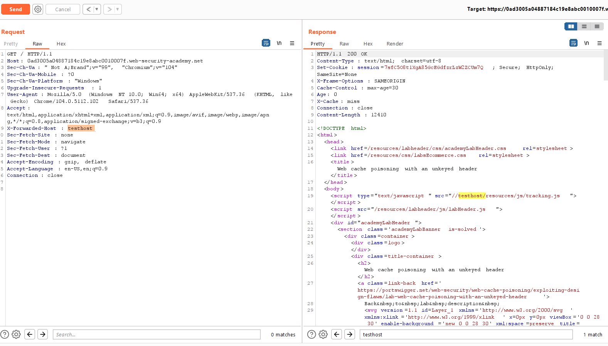

## Web cache poisoning with an unkeyed header

1. Dựa theo hint từ đề bài. Lab hỗ trợ sử dụng `X-Forwarded-Host` header. Khi sử dụng nó ta thấy nó được reflect vào giá trị src của thẻ script 

2. Craft payload xss để inject vào `X-Forwarded-Host` header. 
- Payload: `X-Forwarded-Host: "> </script> `

3. Thành công.