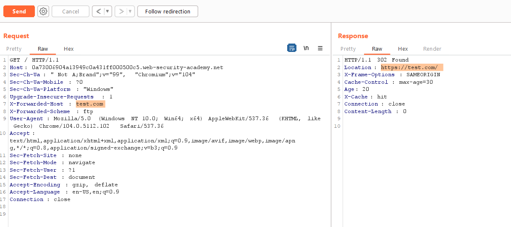
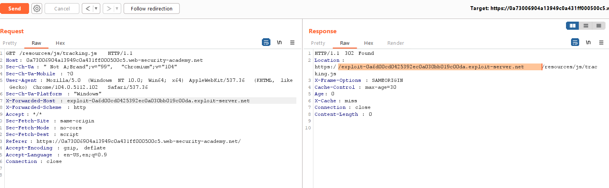
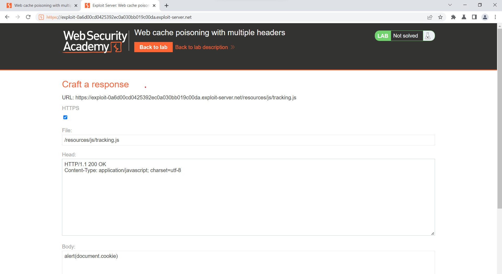
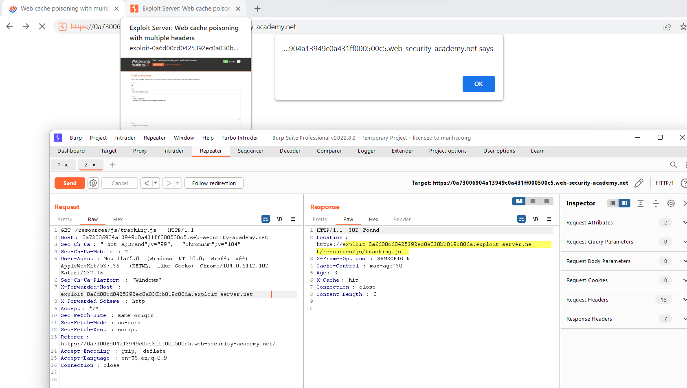

##  Web cache poisoning with multiple headers

1. Thêm `X-Forwarded-Scheme` và `X-Forwarded-Host` header trong trang home nhận thấy trang sẽ có status code 302. Nó sẽ redirect theo giá trị của `X-Forwarded-Host` header

2. Khi có hay không có 2 header trên thì cache sẽ đều lưu response đó trong vòng 1 phút -> unkeyed input 

3. Để hiện alert theo yêu cầu cần redirect trang home tới trang execute js command.

4. Thay đổi giá trị của `X-Forwarded-Host` header để trang redirect về exploit server mà ta kiểm soát. 

5. Craft trang `/resources/js/tracking.js` trên exploit server để thực thi payload. 

6. Gửi lại request lần nữa rồi vào lại trang home để load vào file tracking.js

 