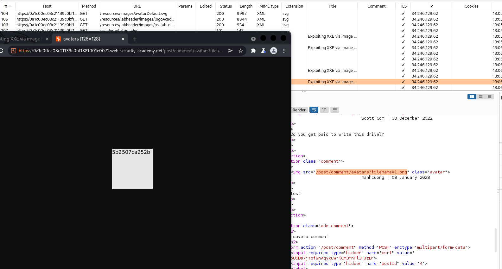

## Exploiting XXE via image file upload (REFER)

1. Được biết file SVG có các format sử dụng XML. Do đó ta sẽ chèn payload để XXE trong file `avatar.svg`

[avatar.svg](\asset/../avatar.txt)

2. Submit comment với `avatar.svg`. Khởi tạo thực thể `xxe` rồi gọi tới nó trong thẻ svg sử dụng XLink để liên kết giữa các resources.

