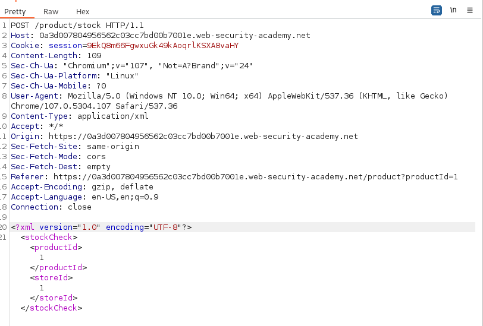
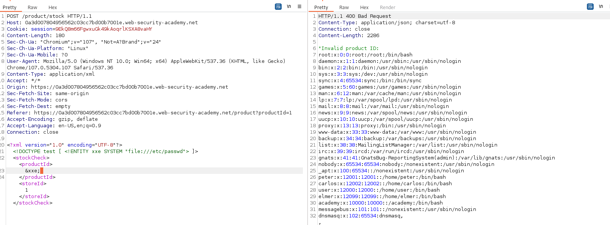

## Exploiting XXE using external entities to retrieve files

1. Trong chức năng check stock sản phẩm có thể thấy đoạn mã xml sẽ được gửi lên server để query dữ liệu. 



2. Khai báo 1 external entity mới trong DTD để đọc file /etc/passwd
- Payload: ```<!DOCTYPE test [ <!ENTITY xxe SYSTEM "file:///etc/passwd"> ]>```

3. Cuối cùng hiển thị nội dung file passwd bằng cách gọi tới entity ``&xxe;``

