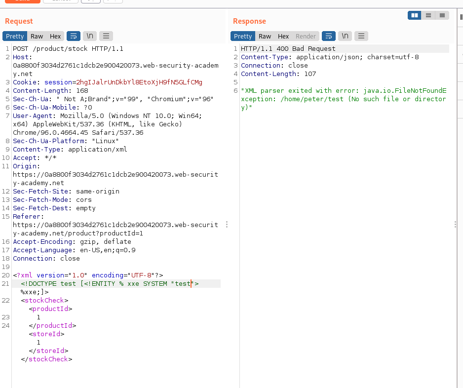

## Exploiting blind XXE to retrieve data via error messages

1. Nhận thấy khi thử select 1 file không có trên server trong response sẽ trả về một error message rất rõ ràng kèm đường dẫn file.

2. Gửi một file external DTD lên exploit server với nội dung.
- Một XML parameter entity `file` chứa nội dung file /etc/passwd
- Một XML parameter entity `eval` chứa XML dynamic parameter entity `exfil` rồi gán nội dung file gán trong `%file;` vào sau một path không tồn tại trên server để trong thông báo lỗi của site sẽ chứa nội dung cần lấy.
=> Nội dung file ``exploit.dtd``

3. Sau đó gửi request với thực thể `xxe` tham chiếu từ external DTD trên exploit server

