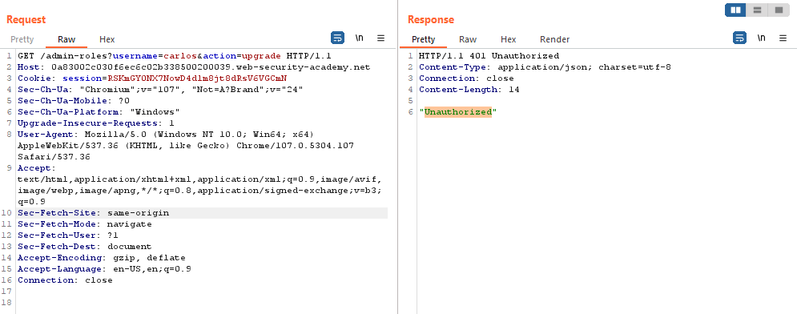
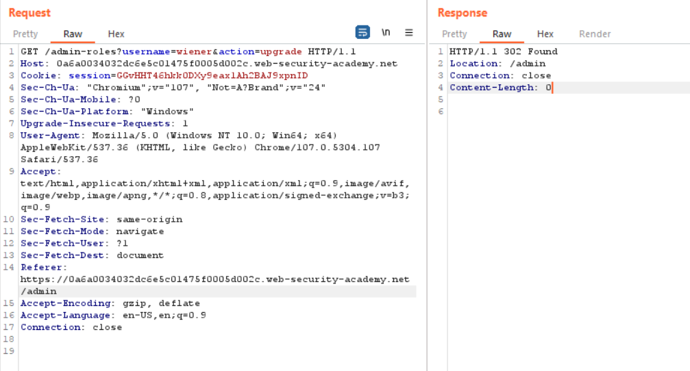

## Referer-based access control (REFER)

1. Đăng nhập vào tài khoản ``administrator``, thử chức năng nâng quyền user
 
2. Trong Http history gửi GET request nâng quyền vào Burp repeater, thử xóa header referer đi rồi gửi thì nhận được message là: ``Unauthorized`` -> từ đó có thể thấy mặc dù chạy trên tài khoản admin nhưng nếu không để referer từ ``/admin`` thì các sub-page cũng không được cấp quyền truy nhập

1. Đăng nhập vào tài khoản ``wiener:peter`` lấy cookie của wiener thay vào GET request trong burp repeater, đồng thời thay param username thành wiener, referer từ trang ``admin`` rồi gửi request.

4. User ``wiener`` đã được leo quyền lên admin.