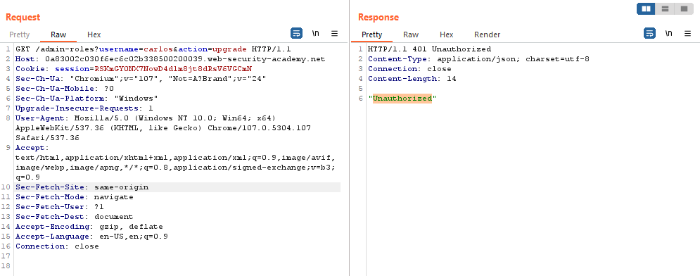

## Referer-based access control

1. Đăng nhập vào tài khoản ``administrator``, thử chức năng nâng quyền user

2. Trong Http history gửi GET request nâng quyền vào Burp repeater, thử xóa header referer đi rồi gửi thì nhận được message là: ``Unauthorized`` -> từ đó có thể thấy mặc dù chạy trên tài khoản admin nhưng nếu không để referer từ ``/admin`` thì các sub-page cũng không được cấp quyền truy nhập

3. Đăng nhập 