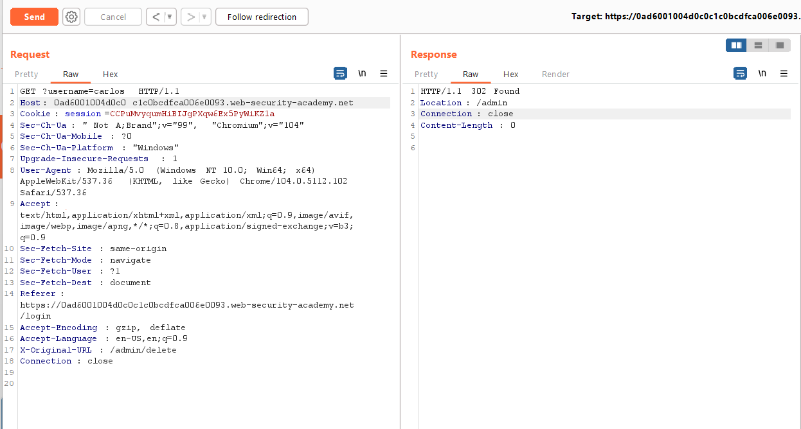

## URL-based access control can be circumvented

1. Theo mô tả lab, ta không thể truy cập đến path ``/admin`` do các config từ phía front-end, nhưng ở phía back-end lab có hỗ trợ ``X-Original-URL`` header. 

2. Gửi `` GET /admin`` request vào Repeater. Thêm header ``X-Original-URL = /admin`` đồng thời thay đổi path. 

3. Truy cập thành công vào admin panel. Nhận thấy url để xóa acc carlos là ``/admin/delete/?username=carlos``. Chỉnh sửa request 

4. Thành công