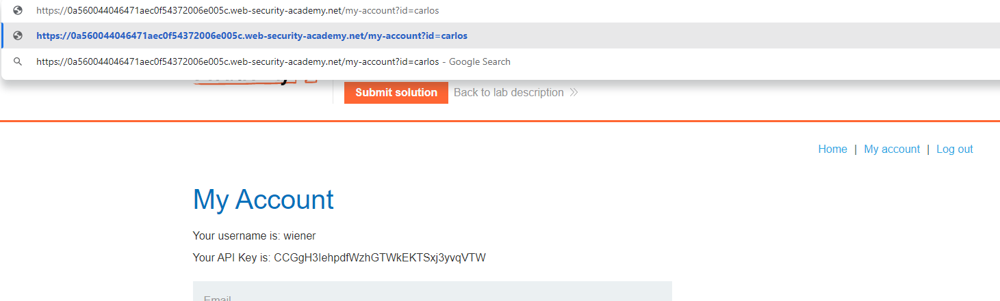
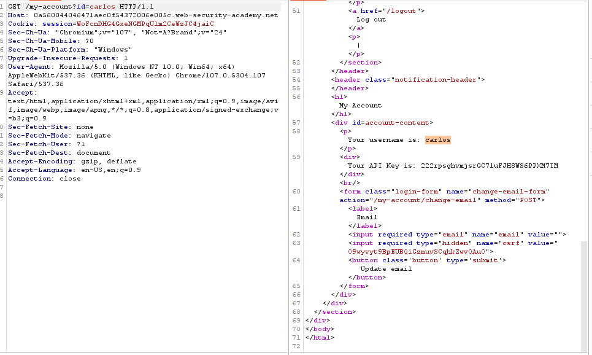

## User ID controlled by request parameter with data leakage in redirect

1. Đăng nhập vào tài khoản ``wiener:peter``, bấm ``My account`` , rồi thay đổi giá trị parameter id thành carlos 

2. Nhận thấy trang sẽ redirect về trang login tuy nhiên trong response trả về lại chứa thông tin api key của carlos

