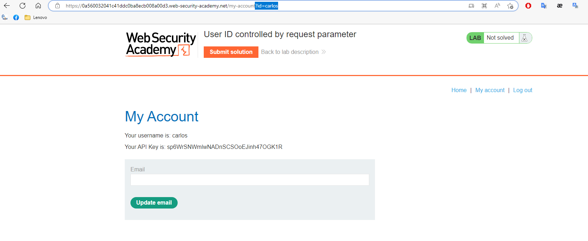

## User ID controlled by request parameter
1. Ở lab này, ta được cung cấp tài khoản ``wiener:peter``, login vào tài khoản này rồi truy cập tới trang admin ``/admin`` thì nhận được message là ``Admin interface only available if logged in as an administrator``. 

2. Theo đề bài chúng ta có thể sửa user role trong phần profile. Dựa vào đó ta thử thay đổi mật khẩu của user, nhận thấy response trả về có chứa giá trị ``"roleid": 1``

3. Lab cũng cho biết admin có roleid = 2, ta sẽ gửi POST request /change-email với tham số bổ sung là ``"roleid":2``

4. Vào trang ``/admin`` thì nhận thấy wiener đã trở thành admin -> xóa user ``carlos``

