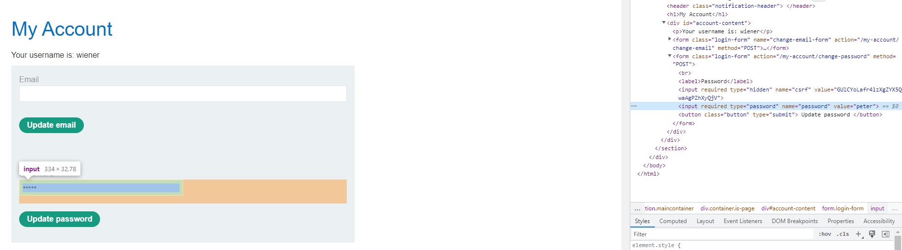
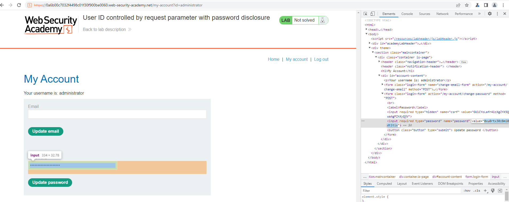
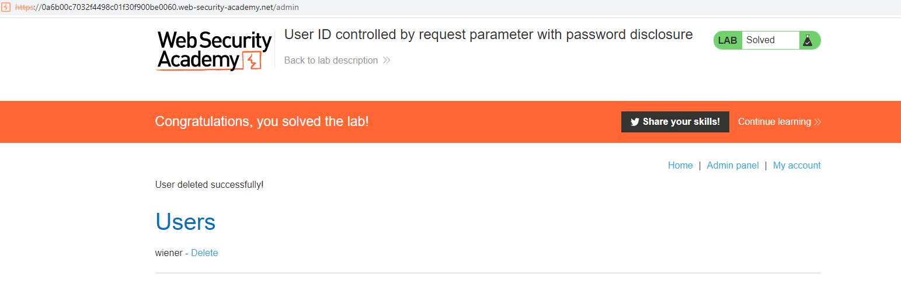

## User ID controlled by request parameter with password disclosure

1. Đăng nhập vào tài khoản ``wiener:peter``, nhận thấy tại trang ``my-account`` chứa password hiện tại 

2. Theo đề bài, tài khoản admin có username là administrator. Thay đổi giá trị parameter id thành ``administrator`` -> từ đó lấy được mật khẩu của tài khoản admin là ``0xu0rtx30z8mi0dt1tis``

3. Logout khỏi wiener rồi đăng nhập vào tài khoản ``administrator:0xu0rtx30z8mi0dt1tis`` -> vào admin panel -> xóa user carlos

