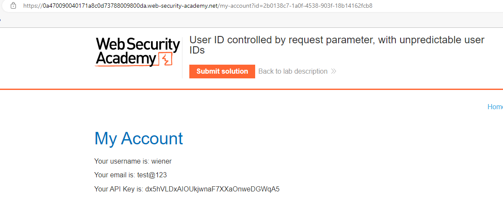
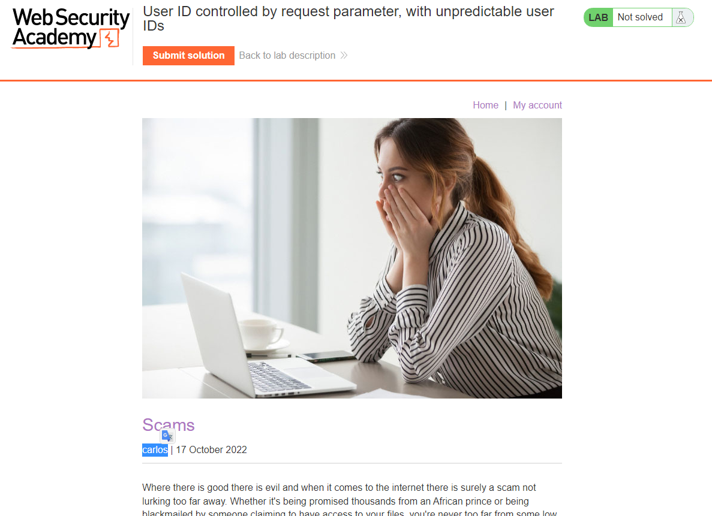
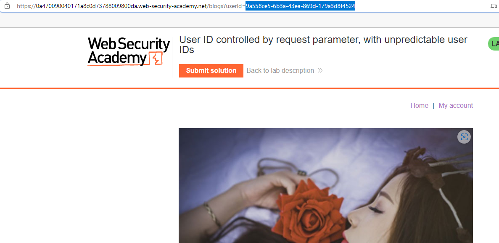
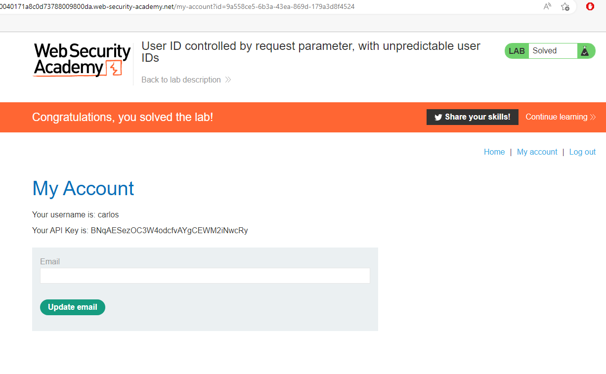

## User ID controlled by request parameter, with unpredictable user IDs

1. Sau khi đăng nhập vào tài khoản, ta thấy ở phần parameter của id là GUIDs do vậy không thể truy cập vào trang my-account của user khác một cách trực tiếp được.

2. Về trang home thử đọc lần lượt các blog ta thấy có blog của carlos 

3. Bấm vào nó, ta sẽ có được GUID của carlos 

4. Lấy GUID của carlos thay cho wiener ở trang ``/my-account``  

