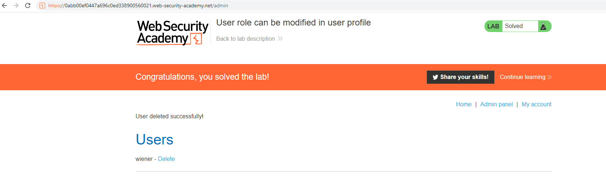

## User role can be modified in user profile

1. Chúng ta được cung cấp tài khoản ``wiener:peter``, login vào tài khoản này truy cập vào trang ``/my-account``

2. Nhận thấy ở URL của trang có thêm tham số ``?id=wiener``, đổi ``wiener`` thành ``carlos`` ta có thể lấy thông tin của account ``carlos``

