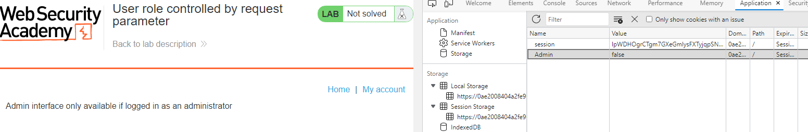
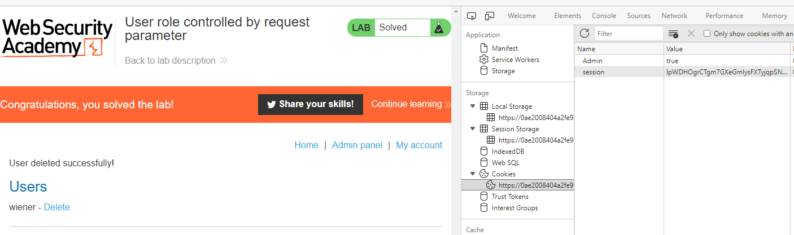

## User role controlled by request parameter

1. Ở lab này, ta được cung cấp tài khoản ``wiener:peter``, login vào tài khoản này rồi truy cập tới trang admin ``/admin`` thì nhận được message là ``Admin interface only available if logged in as an administrator`` đồng thời khi inspect source tại đây ở phần cookie ta nhận thấy có  cookie ``Admin==false``

2. Sửa giá trị false trong ``Admin`` thành true và reload lại trang ``/admin``

