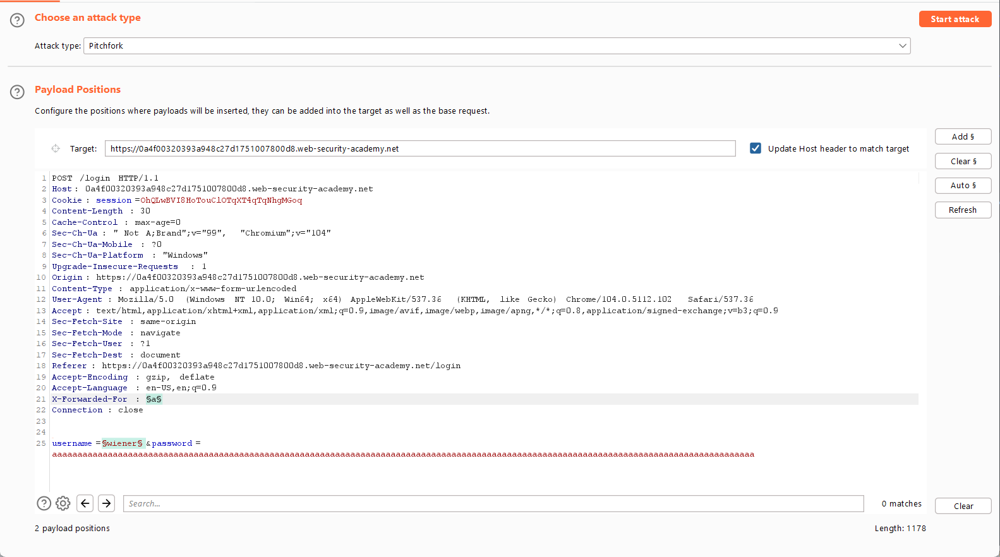
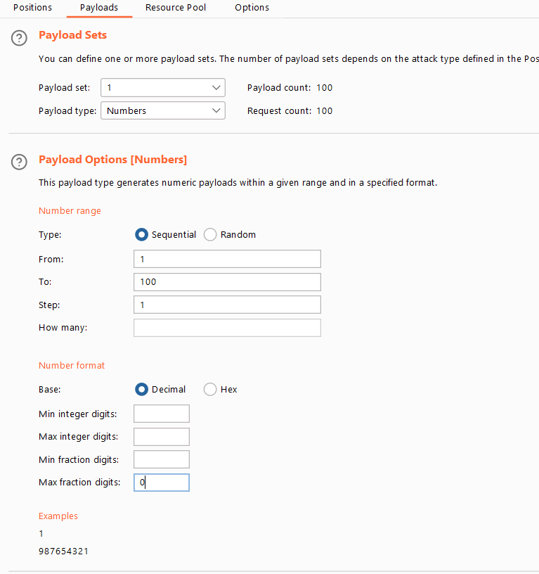
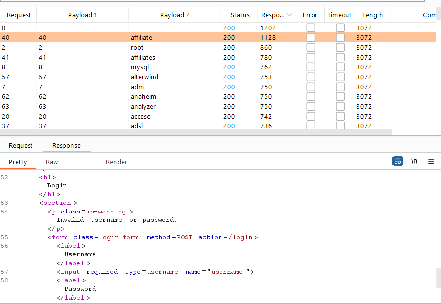
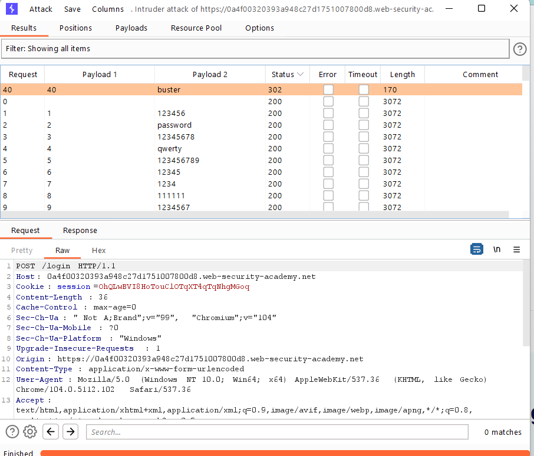

## Username enumeration via response timing (REFER)

1. Theo như mô tả của lab, ta sẽ xác định user:password cần tìm ở lab này bằng thời gian server gửi lại phản hồi.

2. Thử login vào wiener với password sai, dài -> Nhận thấy response time lâu hơn với password ngắn. Còn với username khác thì mk ngắn hay dài đều có response time ngắn
- -> Lab có thể sẽ xác thực username trước, nếu username đúng thì sẽ tiến hành hash password - lý do dẫn đến response time lâu hơn.

3. Nhận thấy lab này bị giới hạn số lần xác thực sai. Sau 3 lần xác thực sai, có lẽ IP của máy đã bị block bởi server. 

4. Gửi request ``POST /login`` vào Intruder với kiểu ``Pitchfork``, payload là username và password sẽ là 1 pw dài. Ngoài ra, thêm ``X-Forwarded-For`` header vào header của request.

5. Ở tab `Payloads`, với ``username`` payload ta sẽ paste username list được cung cấp vào còn ở ``X-Forwarded-For`` payload chọn type là Number với các số nguyên chạy từ 1-100 -> Attack

6. Sau khi chạy, thêm col ``Response completed``

-> Nhận thấy username ``affiliate`` có thời gian phản hồi lâu và khác biệt nhất trong danh sách -> Khả năng cao đây là username đúng.

7. Tiếp theo tiến hành brute-force password với username ``affiliate`` 

8. Thông tin đăng nhập phù hợp là ``affiliate:buster``