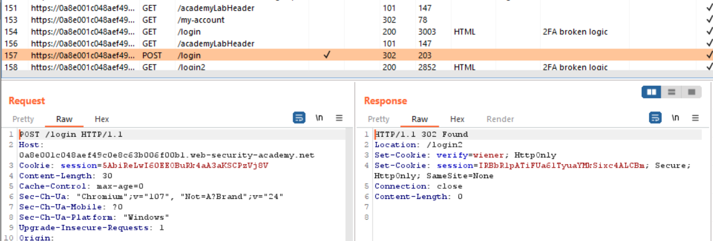
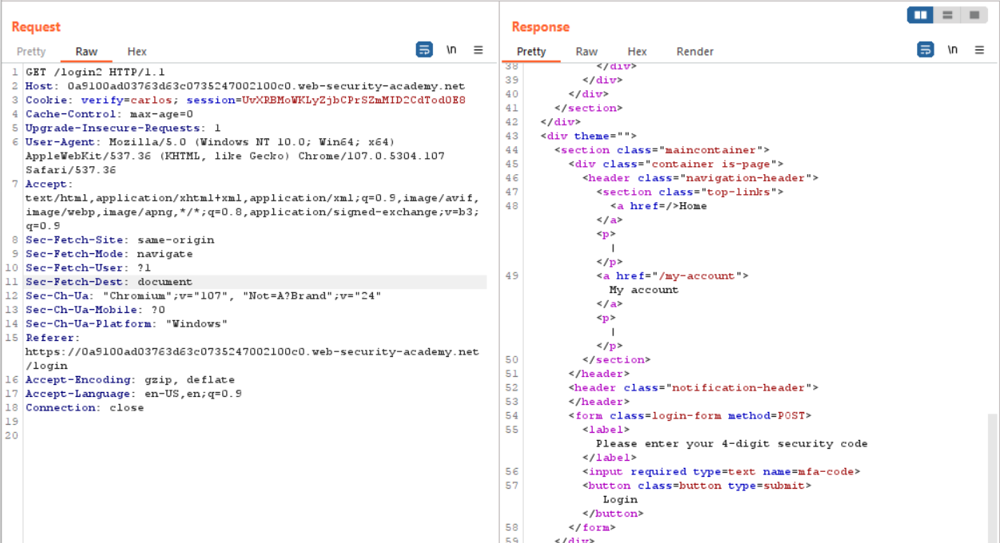
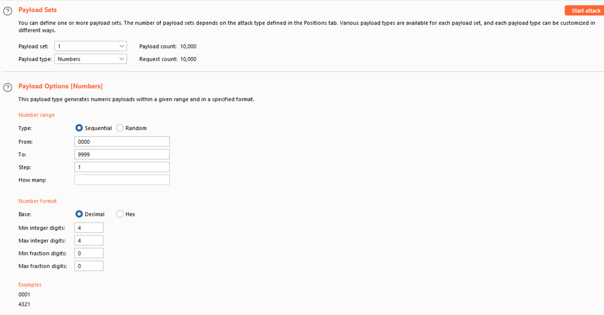
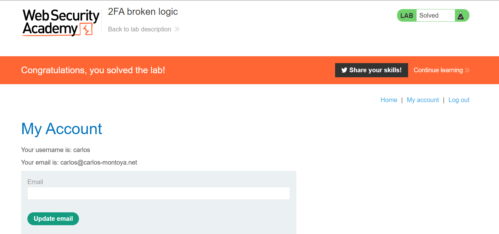

### 2FA broken logic

1. Thử login và verify vào account ``wiener:peter``. Nhận thấy trong trong các login request được set cookie ``verify=wiener`` được sử dụng để xác thực  user đang cố truy cập.

1. Do không có password của ``carlos`` nên ta sẽ gửi lại request để server generate một mfa-code mới cho tài khoản carlos bằng cách thay đổi giá trị ``verify``  thành ``carlos``  trong `GET /login2`  request.

 

3. Gửi  `POST /login2`  request tới Burp Intruder để tiến hành brute-force mfa-code. Set ``verify=carlos``. Add § ``mfa-code`` với payload chạy từ ``0000`` -> ``9999``

1. Sau khi chạy, ta thấy với ``mfa-code=0578`` status code là 302 -> tức web được redirect tới trang my-account của ``carlos``. 
 
 