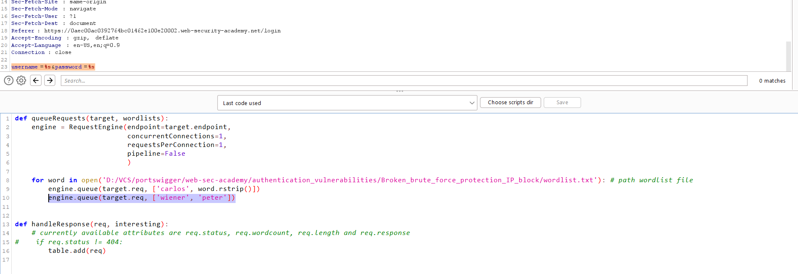
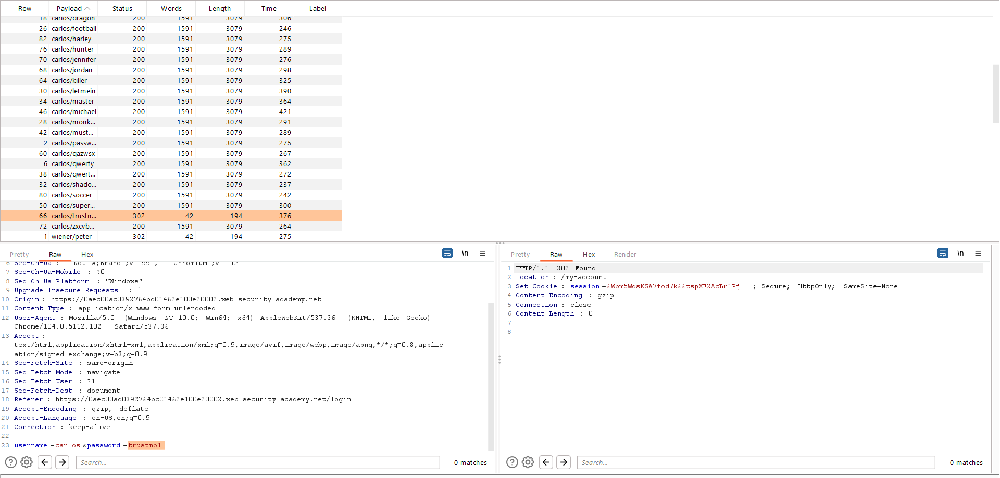

## Broken brute-force protection, IP block

1. Nhận thấy lab này bị giới hạn số lần xác thực sai. Sau 3 lần xác thực sai, IP của máy đã bị block bởi server trong 1 phút. 

2. Theo mô tả của lab, ta có thể sử dụng Turbo Intruder extension. Gửi request ``POST /login`` vào Turbo Intruder. 

3. Với 2 payload là username và password. Với wordlist được cung cấp ``password.txt``. Và tại vì server chỉ cho phép sai thông tin đăng nhập trong 3 lần do đó ta cần login lại vào acc ``wiener`` để có thể reset lại số lần nhập sai.

4. Sau khi chạy xong, ta nhận thấy trong các request có username là ``carlos`` thì có 1 request có code ``302`` -> Thông tin đăng nhập cần tìm là ``carlos:trustno1``

