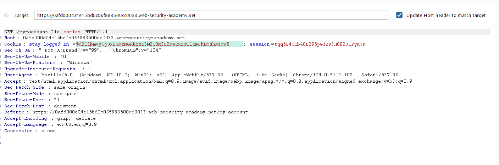

## Brute-forcing a stay-logged-in cookie

1. Sau khi thử đăng nhập vào tài khoản ``wiener:peter`` với select Stay logged in nhận thấy trong response của request này có tạo 1 cookie ``stay_logged_in`` mà khi inspector vào giá trị này có thể thấy nó được mã hóa base64 với định dạng ``username:{$s}`` với $s có thể là mã hóa của password.

2. Nhận ra $s là encode của md5('peter')

3. Tạo ``stay_logged_in`` cookie với từng password cho ``carlos`` với [handle.py](\asset/../handle.py)

4. Gửi request ``GET /my-account?id=`` vào Intruder đặt vị trí payload ở ``stay_logged_in`` cookie, thay ``id=carlos`` và payload từ [cookie.txt](\asset/../cookie.txt)

5. Sau khi chạy, ta nhận thấy có một request có status code = 200 -> Thành công

