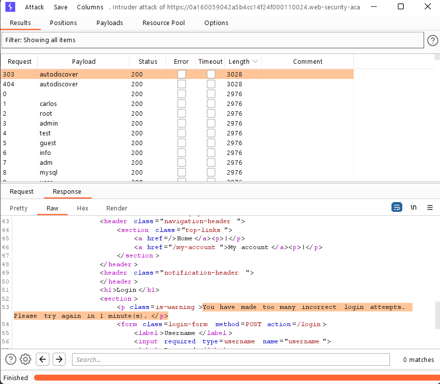
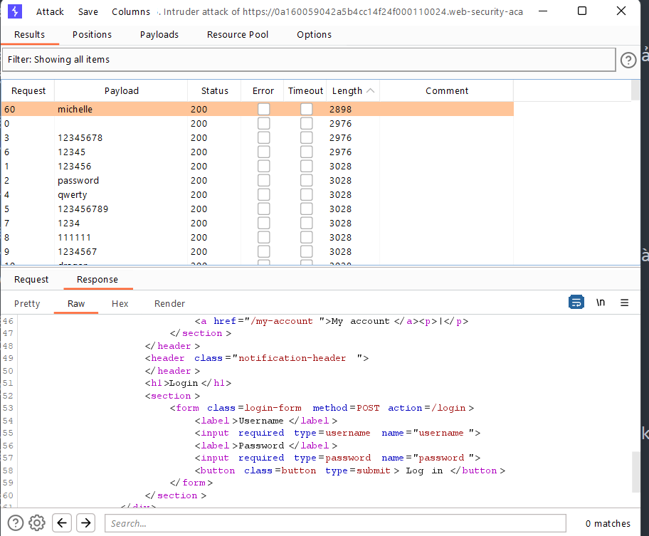

## Username enumeration via account lock

1. Theo đề bài, lab này có chứa lỗ hổng trong chắc năng khóa tài khoản sau số lần nhập sai thông tin đăng nhập nhất định.

2. Tiến hành brute-force username với password bất kỳ. Lặp lại nhiều lần list username.

3. Nhận thấy với username = ``autodiscover`` có độ dài khác với các response khác. Trong response này nhận thấy có vẻ như username này là đúng và sau nhiều lần nhập mật khẩu sai đã bị block.

4. Tiến hành brute-force password với username ``autodiscover`` cùng với list password được cung cấp. 

5. Sau khi chạy thì nhận thấy với password = ``michelle`` có độ dài khác với các response khác.

-> Thông tin đăng nhập là ``autodiscover:michelle``