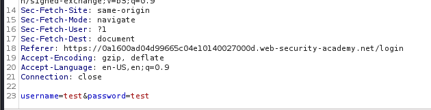
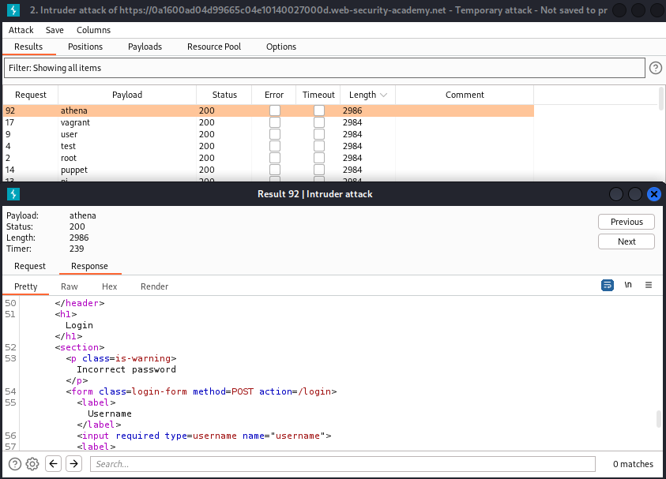
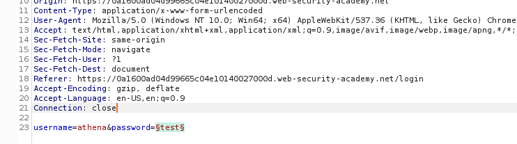
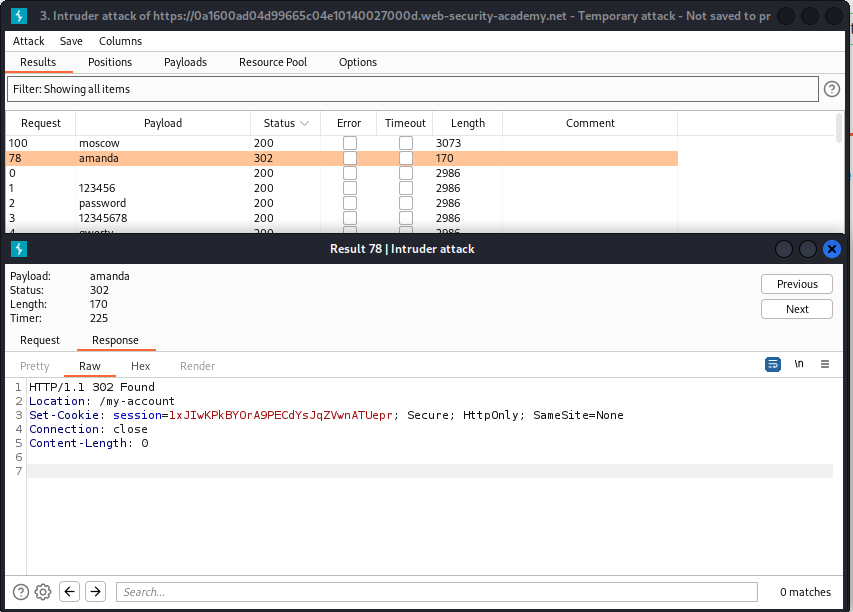
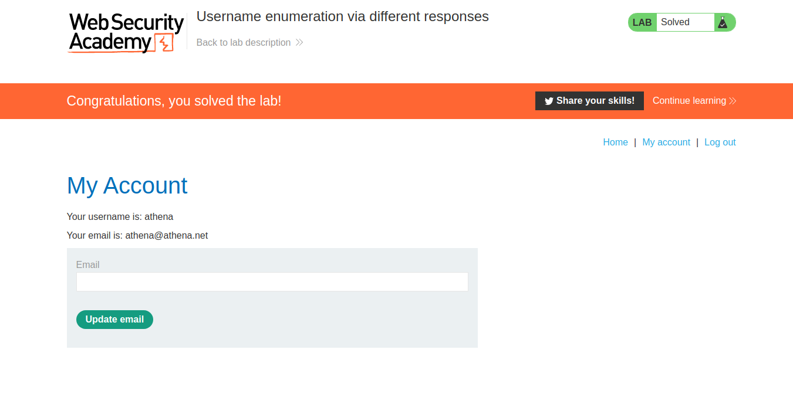

### Username enumeration via different responses

1. Lab cung cấp cho chúng ta list username và password

2. Khi tôi cố gắng login với một tài khoản bất kỳ thì nhận được messages là ``Invalid username`` , ta có thể lợi dụng điều này để điều tra ra username  hợp lệ thông qua username list.

3. Trong Burp Suite, ta sẽ chuyển request post/login tới tab intruder  có dòng ``username=test&password=test``, tiến hành attack với payload username được cung cấp

<<<<<<< HEAD

=======
>>>>>>> 7b7198b9c53321043588bf3024a549413c96af0d
 

4. Sau khi chạy, ta phát hiện payload = ``athena`` có độ dài khác với những payload còn lại và thấy trong response của nó có dòng ``Incorrect password``  -> Username found: ``athena``

 

5. Tương tự, thay username vào và tiến hành brute-force password với password list được cung cấp

 

6. Sau khi chạy, ta thấy với password là ``amanda`` có status code 302 -> Password found: ``amanda``

 

7. Login bằng username và password phía trên

 
 