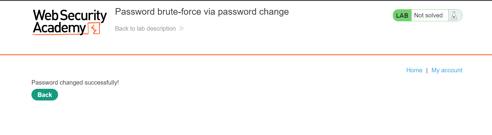
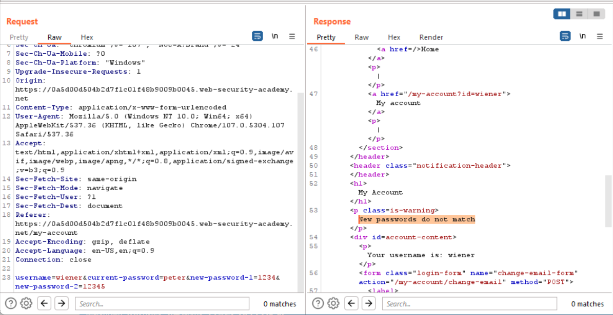
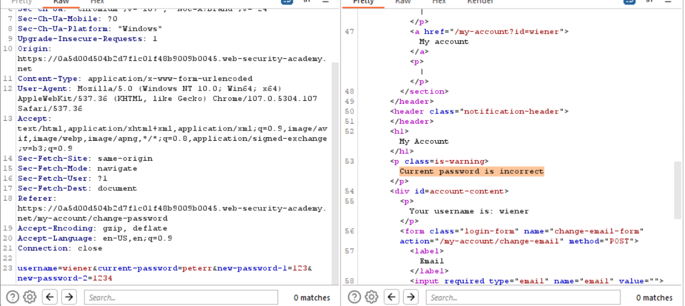
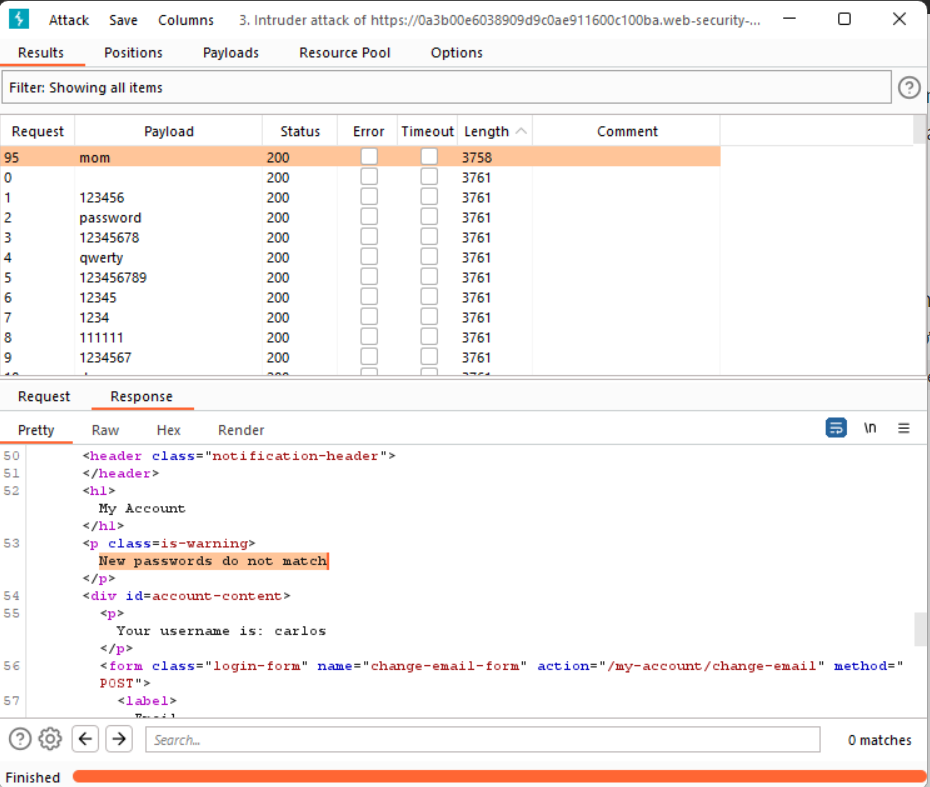
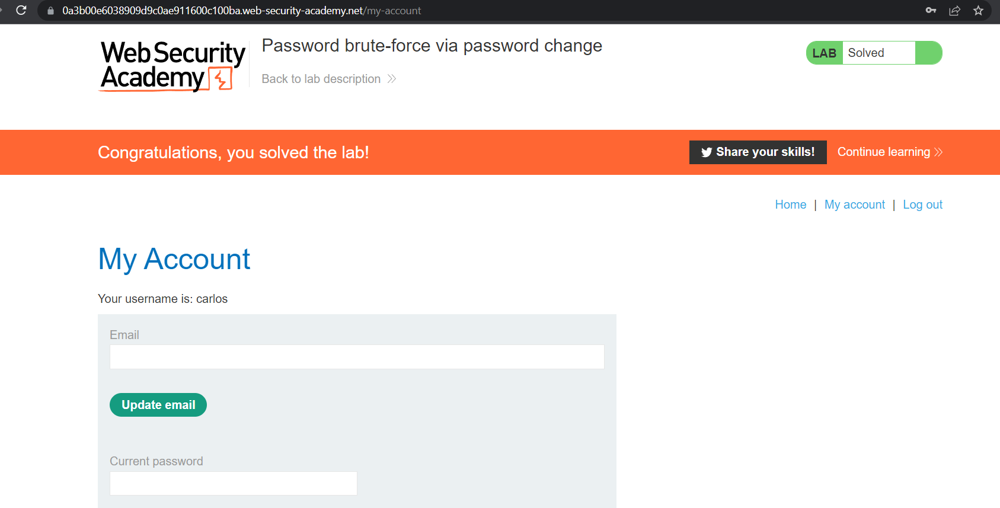

## Password brute-force via password change

1. Đăng nhập vào tài khoản ``wiener:peter``, thử chức năng đổi mật khẩu. Khi mà thay đổi mật khẩu thành công trang sẽ hiện lên thông báo và redirect về trang ``login``

 
2. Thử với trường hợp ta nhập đúng password hiện tại nhưng confirm password lại không giống nhau sẽ nhận được message ``New password  do not match`` 

3. Thử tiếp với trường hợp ta nhập sai password hiện tại và cũng sai luôn cả confirm password thì sẽ được message ``Current password is incorrect``

4. Do đó ta sẽ tiến hành brute-force ``current-password`` với password list được cung cấp đồng thời confirm password sai và thay đổi ``username=carlos`` 

5. Nhận thấy với payload ``mom`` có độ dài khác -> đó là mật khẩu của carlos -> login vào tài khoản ``carlos:mom``

