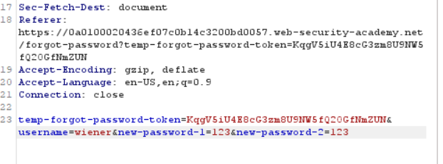
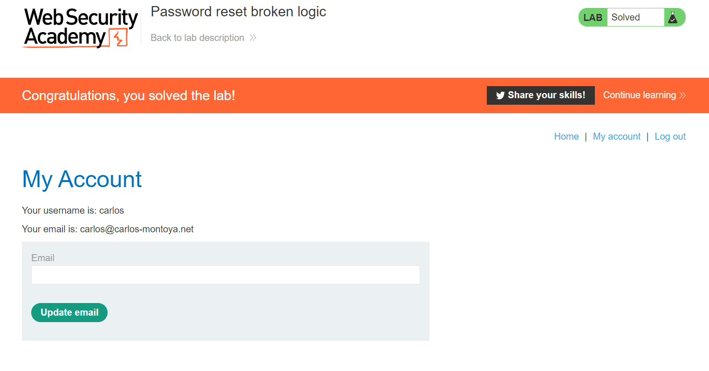

### Password reset broken logic

1. ở lab này, lỗ hổng nằm ở chức năng forgot password.

2. Thử sử dụng chức năng này với tài khoản ``wiener``  
 
3. Xem request đổi password, ta thấy trong request body có ``username=wiener``. Thử đổi thành ``username=carlos``

4. Log in với mật khẩu vừa đổi.
 
 
