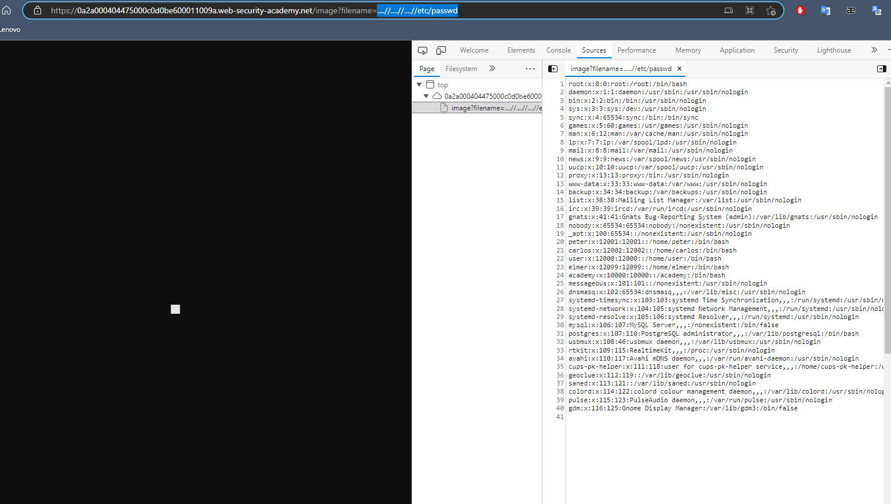

## File path traversal, traversal sequences stripped non-recursively

1. Dựa vào mô tả lab ta có thể thực thi file path traversal trong đường dẫn tới hình ảnh của sản phẩm để có thể truy xuất nội dung trong file ``passwd`` trên server. Tuy nhiên ở lab này mô tả rằng sẽ strips travelsal sequences input trước khi gửi request nhưng sẽ không đệ quy. Tức là với input ``....//`` trước khi gửi request sẽ được chuyển thành ``../``  
-> payload:
- ```....//....//....//etc/passwd```

