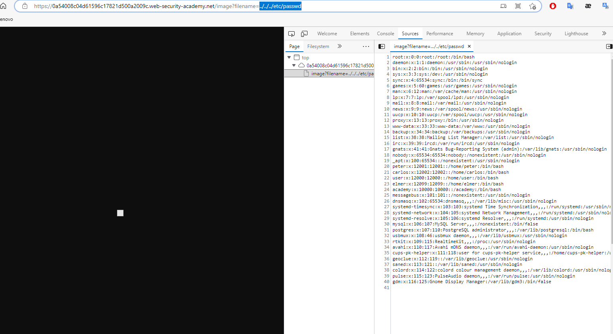

## File path traversal, simple case

1. Dựa vào đề bài của lab ta có thể thực thi file path traversal trong đường dẫn tới hình ảnh của sản phẩm để có thể truy xuất nội dung trong file ``passwd`` trên server. Tăng dần (../) để tiến về thư mục root chứa etc.
Payload: 
- ```../etc/passwd```
- ```../../etc/passwd```
- ```../../../etc/passwd```

