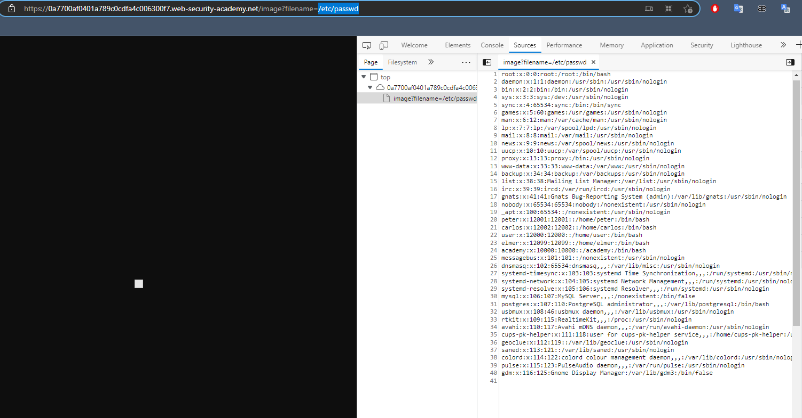

## File path traversal, traversal sequences blocked with absolute path bypass

1. Dựa vào mô tả lab ta có thể thực thi file path traversal trong đường dẫn tới hình ảnh của sản phẩm để có thể truy xuất nội dung trong file ``passwd`` trên server. Tuy nhiên ở lab này traversal sequence đã bị block, dựa vào đề bài ta thử truy vấn trực tiếp đến đường dẫn tuyệt đối với payload :
- ```/etc/passwd``` 

