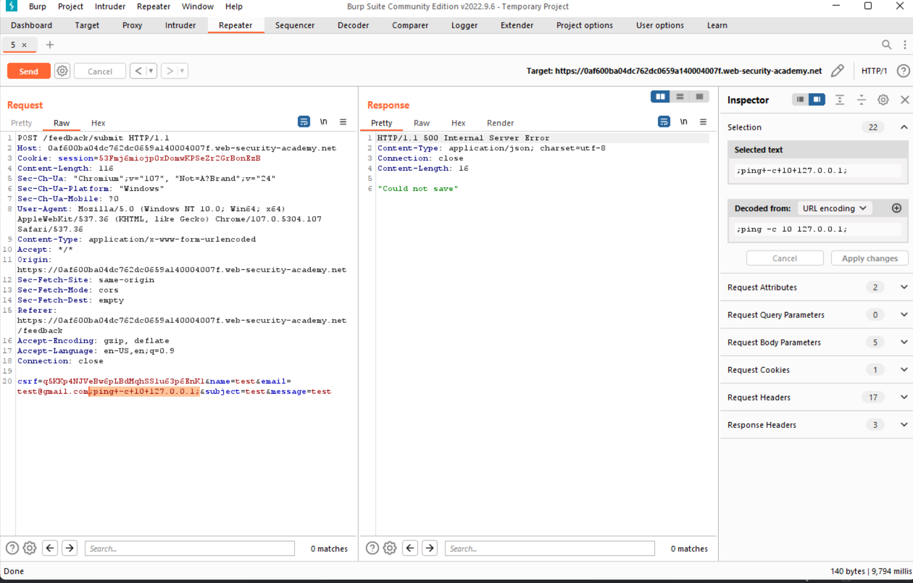
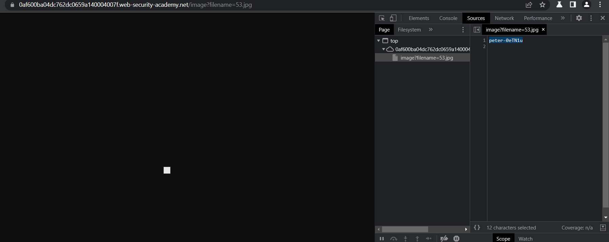

## Blind OS command injection with output redirection

1. Theo đề bài, lab có chứa lỗ hổng blind os command trong chức năng feedback. Output của lệnh sẽ không được trả về trong response. Sử dụng time delays để xác định param có chứa lỗ hổng.
Payload:
- ```test;+ping+-c+10+127.0.0.1+;```



-> Xác định được param ``email`` có lỗ hổng khi chèn payload vào server mất 10s để trả lại phản hồi

3. Theo đề bài, folder ``/var/www/images/`` có quyền viết. Chèn output ``whoami`` command vào ảnh có tên ``53.jpg`` trong folder 
Payload:
- ```;whoami+>+/var/www/images/53.jpg;```

4. Gửi request. Reload lại url của ảnh, Inspect trang web trong phần source nhận được tên người dùng cần tìm

