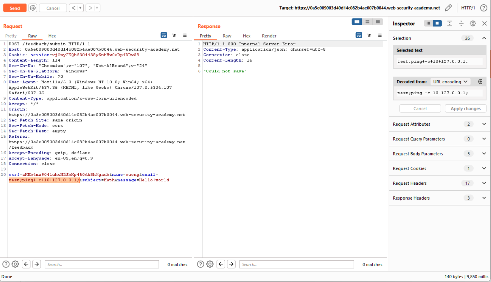

## Blind OS command injection with time delays

1. Theo đề bài, lab có chứa lỗ hổng blind os command trong chức năng feedback. Output của lệnh sẽ không được trả về trong response nên sẽ dựa vào thời gian delay mà ứng dụng trả lại phản hồi để xác định.

2. Submit feedback bất kỳ rồi gửi vào Burp Repeater. Thử từng param với payload:
- ```test;ping+-c+10+127.0.0.1;```

