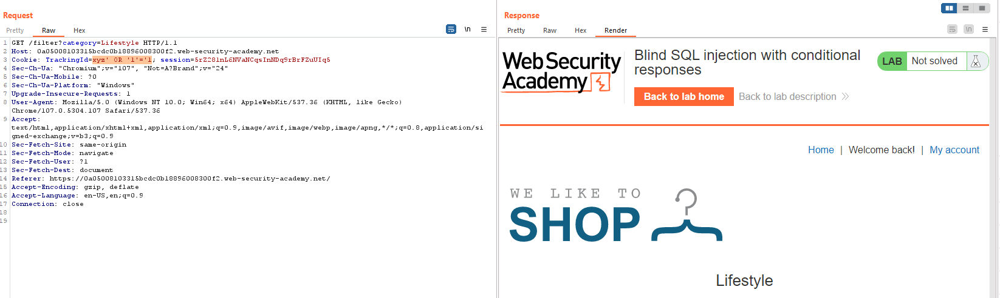
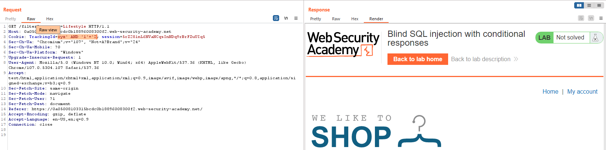
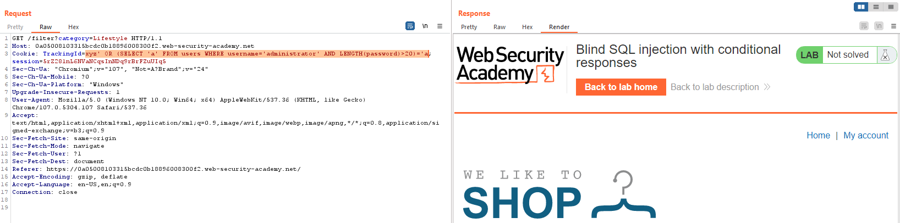
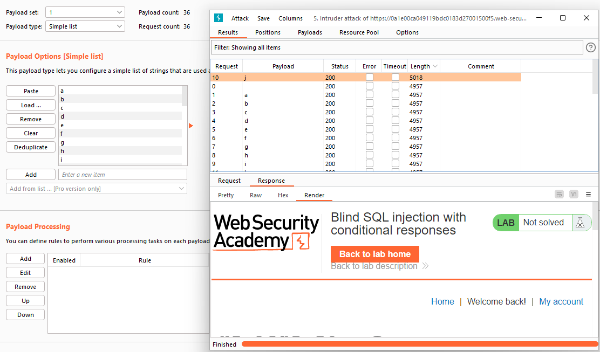

## Blind SQL injection with conditional responses (REFER)

1. Theo đề bài của lab thì server sẽ tiến hành truy vấn SQL bằng value của ``TrackingId`` cookie. Và message ``Welcome back`` sẽ xuất hiện nếu truy vấn trả về bất kỳ hàng nào. Thử với payload ```xyz' OR '1'='1``` chắc chắn rằng truy vấn sẽ trả về ít nhất 1 hàng.



2. Thử với payload ```xyz' AND '1'='2``` thì không nhận được messsage nữa.



-> Từ đó chứng tỏ ta có thể lợi dụng điều này để xác minh câu truy vấn có điều kiện của mình đúng hay không.
3. Lần lượt tăng dần {NUMBER} trong payload ```xyz' OR (SELECT 'a' FROM users WHERE username='administrator' AND LENGTH(password)>{NUMBER})='a``` để xác định độ dài password của user ``administrator``.



-> Với {NUMBER} = 20 response trả về false. Suy ra password của ``administrator`` có 20 ký tự

4. Sau khi đã có độ dài password, tiến hành brute-force bằng những câu truy vấn có điều kiện để tìm ra giá trị của từng vị trí trong password với ``SUBSTRING`` function. Chuyển request tới tab ``Intruder`` thay bằng payload ```xyz' OR (SELECT SUBSTRING(password, 1, 1) FROM users WHERE username = 'administrator')='§a§``` với a nhận giá trị từ a-z và 0-9.



-> Nhận thấy trong các kết quả trả về với payload ``j`` có độ dài khác so với những payload còn lại. Do nó trả về message ``welcome back`` vậy nên password có ký tự đầu tiên là ``j``

5. Tương tự vậy với 19 vị trí còn lại bằng cách thay tham số start position trong ``SUBSTRING`` thành vị trí tương ứng.
-> Password cần tìm là ``jozadl1dct4lr64zs9ey``