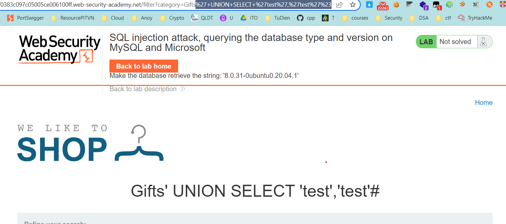
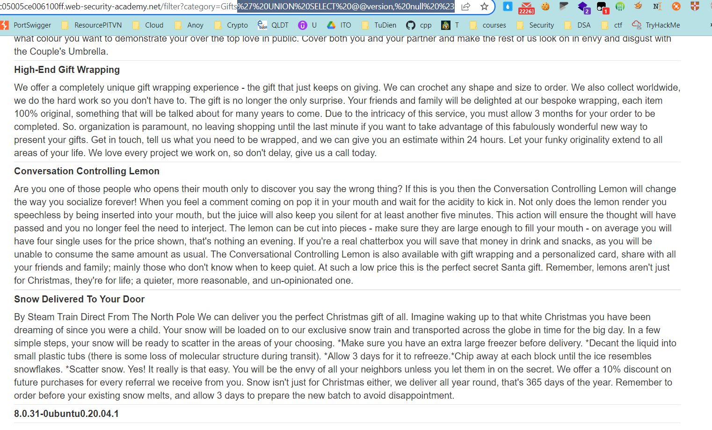

## SQL injection attack, querying the database type and version on MySQL and Microsoft

1. Theo như đề bài, database của lab này là MySQL hoặc Microsoft. Nhận thấy có vẻ như ``--`` comment đã được khắc phục vậy nên ta sẽ thử với syntax comment khác trong mysql và Microsoft SQL với hint từ trang [SQLi cheat sheet](https://portswigger.net/web-security/sql-injection/cheat-sheet)
-> Nhận thấy có thể thay ``--`` bằng cách dùng ``#``

2. Xác định được số cột và những cột có kiểu string. Với payload ```' UNION SELECT 'test','test' #```



-> Xác định được số cột là 2 và cả 2 cột đều có kiểu string
3. Để xác định database version trong Oracle dùng câu query ``SELECT @@version``
Payload: 	
- ```' UNION SELECT @@version, null #```

