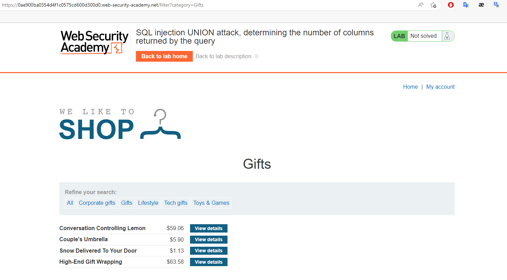
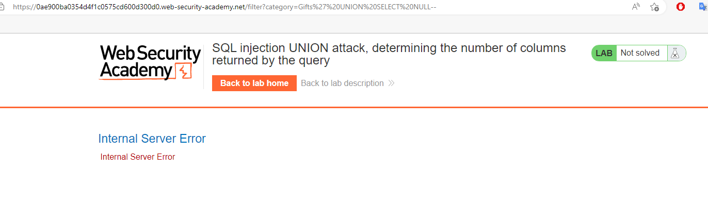
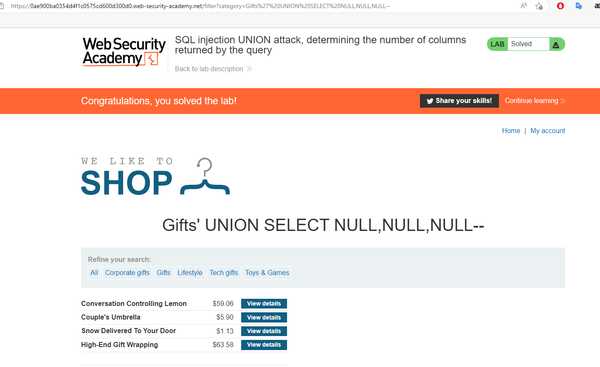

## SQL injection UNION attack, determining the number of columns returned by the query

1. Lab yêu cầu tìm ra số cột của bảng category 



2. Ta sẽ sử dụng lần lượt các câu truy vấn UNION SELECT gắn giá trị ``null`` (Phù hợp với mọi kiểu dữ liệu)  cho từng cột
    ```' UNION SELECT NULL--```



3. Nếu với số giá trị cột sai, response trả về 1 message ``internal server error``

4. Thử lần lượt đến khi câu query là 
    ```' UNION SELECT NULL,NULL,NULL--```



5. Server trả về kết quả bình thường -> Số cột ở đây là 3