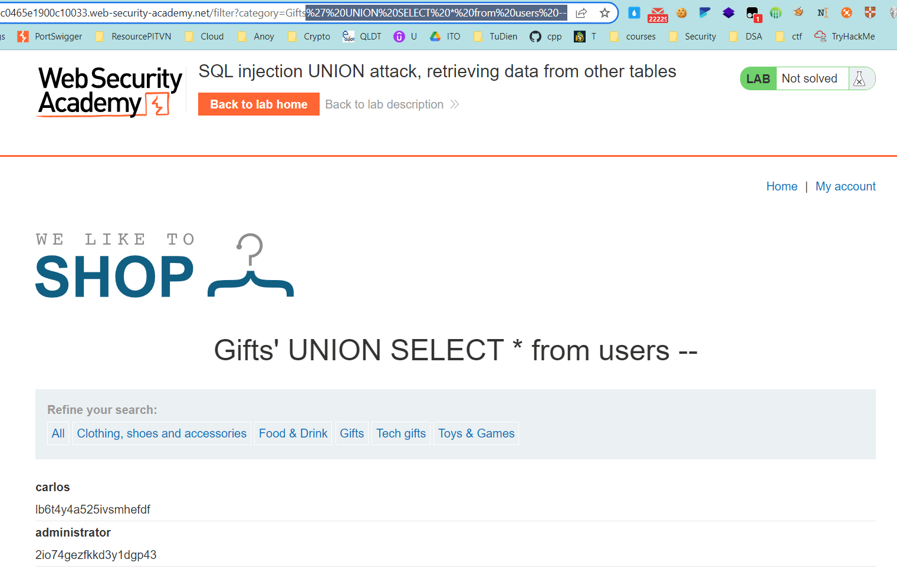
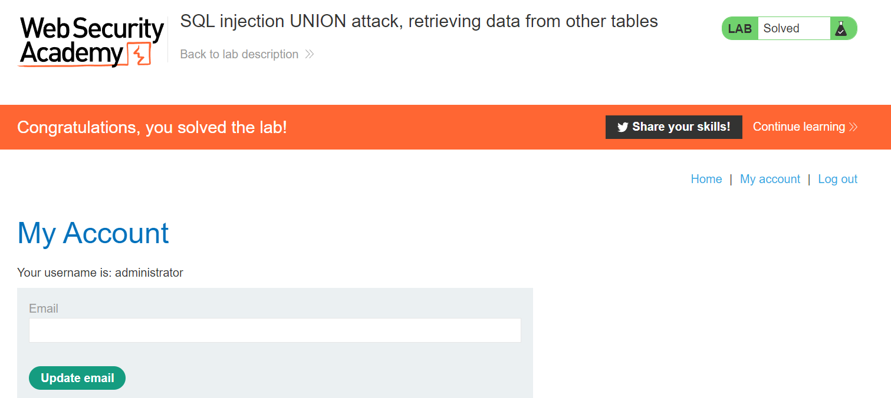

## SQL injection UNION attack, retrieving data from other tables

1. Lab cho ta biết rằng trong database có một bảng ``users`` chứa username và password

2. Sử dụng UNION attack để truy xuất đến dữ liệu trong bảng ``users`` bằng payload 
    ```' UNION SELECT * from users--```



3. Ta thấy response trả về sẽ có chứa username:password của tất cả người dùng trong đó có username admin ``administrator:2io74gezfkkd3y1dgp43`` -> login vào admin

