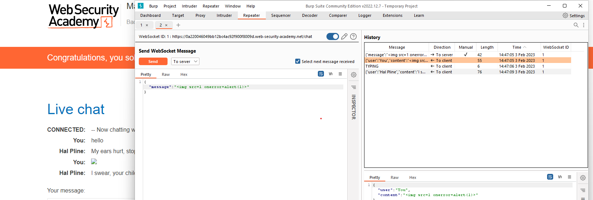

## Manipulating WebSocket messages to exploit vulnerabilities

1. Chức năng live chat sử dụng websocket để trao đổi message giữa browser và agent. 

2. Ở tab websocket history, có ghi lại quá trình trao đổi message giữa browser và agent. 

3. Chuyển request có direction tới server vào repeater rồi sửa thành payload xss hiện popup alert()

