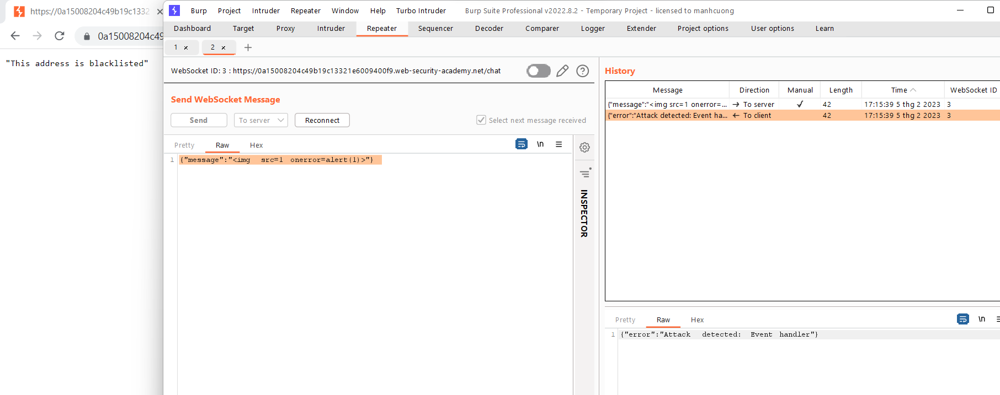
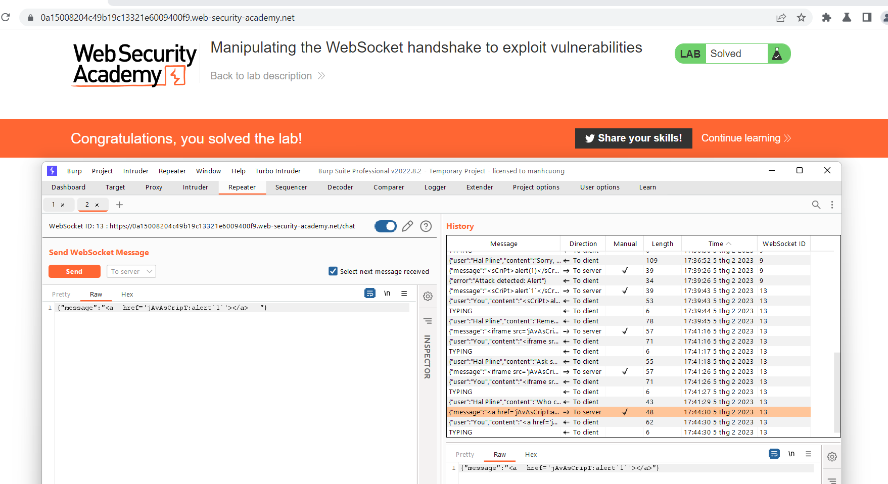

## Manipulating the WebSocket handshake to exploit vulnerabilities

1. Gửi item chuyển tới server vào burp repeater, thay bằng payload ``{"message":""}``. Nhận được message rằng phát hiện event handler disconnect rồi cho địa chỉ ip vào blacklist.

2. Reconnect rồi bypass IP block bằng `X-Forwarded-For` header. 

3. Sau nhiều lần thử các payload khác nhau nhận thấy. Lab sẽ block các thẻ script, javascript protocol, các event. Obfuscation payload ````
 thì thành công.

